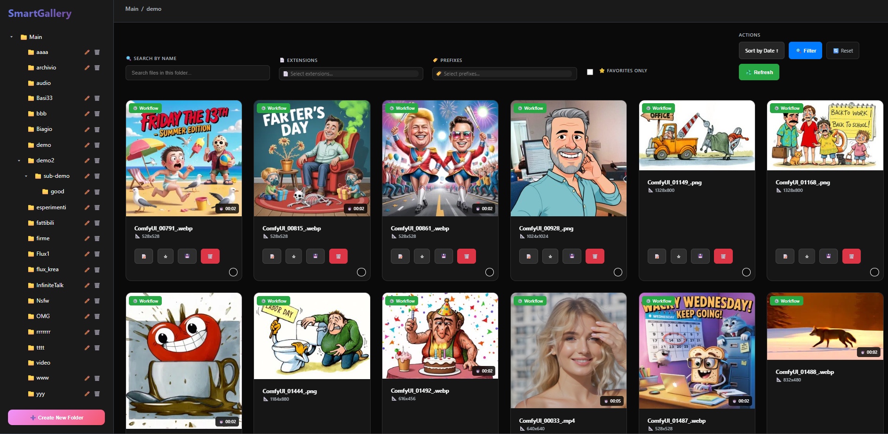
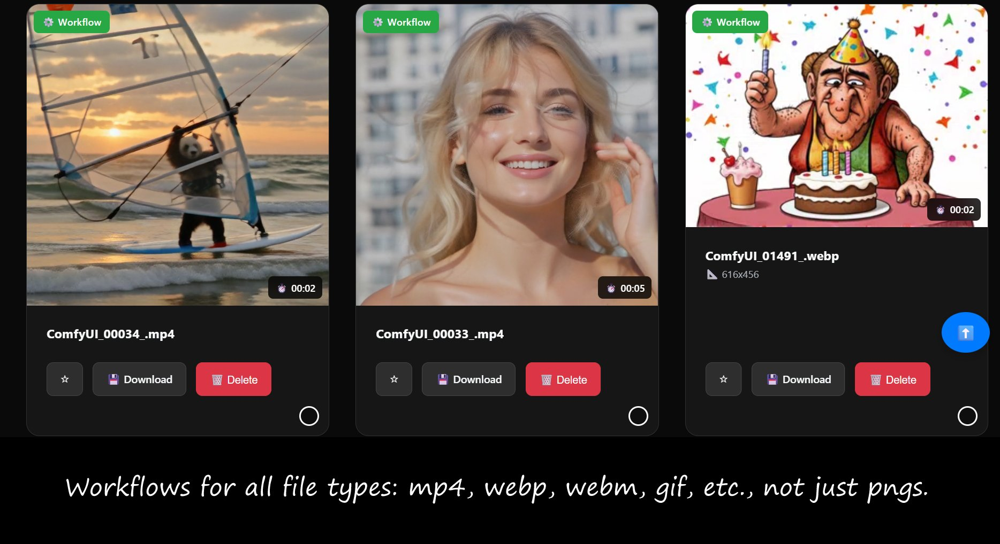
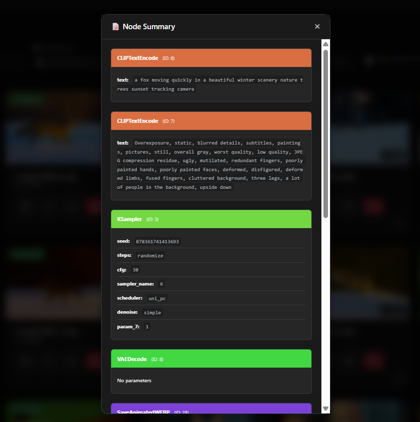
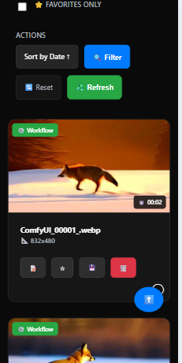

# SmartGallery for ComfyUI ✨
### Your Visual Hub with Universal Workflow Recall, Upload Magic & Intelligent Organization

<p align="center">
  
</p>

<p align="center">
  
</p>

<p align="center">
  <em>🎨 Beautiful, lightning-fast gallery that remembers the exact workflow behind every single creation</em>
</p>

<p align="center">
  
</p>
<p align="center">
  <em>🔍 Instant workflow insights - Node Summary</em>
</p>

<p align="center">
  <a href="LICENSE"></a>
  
  <a href="https://github.com/opj161/smart-comfyui-gallery/stargazers"></a>
</p>

---

## 🆕 What's New in Version 1.31?

- 🔧 **Bulletproof Path Detection**: Now uses ComfyUI's official `folder_paths` API for 100% reliable auto-detection
- ⚙️ **Universal Compatibility**: Works with ALL ComfyUI setups including custom node paths, Docker, network storage, and advanced configurations
- 🚀 **Zero Configuration**: Automatically adapts to any ComfyUI installation method or directory structure
- 🐛 **Critical Fixes**: Resolved startup crashes and path detection failures in non-standard installations

### Previous Updates (v1.30)
- 🔍 **Smart Folder Navigation**: Expandable sidebar with real-time search and bi-directional sorting (A-Z, Z-A, newest, oldest)
- 🖼️ **Enhanced Gallery Sorting**: Toggle thumbnail sorting by date or name with visual indicators
- 🔎 **Advanced Lightbox**: Zoom with mouse wheel, persistent zoom levels, percentage display, and quick delete
- ⚡ **Real-time Sync**: Silent background checks with visual progress overlay when new files are detected
- 📝 **Smart Workflow Names**: Downloaded workflows now match your image filenames

---

## 🚀 The Problem Every ComfyUI User Faces

You've just created the most stunning AI image or video of your life. It's perfect. Absolutely perfect.

**But wait... what workflow did you use?** 😱

Hours later, you're desperately trying to recreate that magic, clicking through endless nodes, tweaking parameters, and pulling your hair out because you can't remember the exact recipe that made it work.

**Plus, what about those amazing AI images someone shared with you? Or that perfect generation you saved from Discord?** You want to know the workflow, but you can't load it into your gallery...

**This stops now.**

---

## 🎯 What Makes SmartGallery Revolutionary

SmartGallery isn't just another image viewer. It's a **time machine for your creativity** that automatically links every single file you've ever generated to its exact workflow—whether it's PNG, JPG, MP4, or WebP.

### ⚡ Key Features That Will Transform Your Workflow

- 🏃‍♂️ **Blazing Fast**: SQLite database + smart caching = instant loading even with thousands of files
- 📱 **Mobile Perfect**: Gorgeous interface that works flawlessly on any device
- 🔍 **Node Summary Magic**: See model, seed, and key parameters at a glance
- 📁 **Smart Organization** 🆕: Expandable sidebar with real-time search, bi-directional sorting (name/date), and intuitive folder management
- 🖼️ **Enhanced Gallery View** 🆕: Sort thumbnails by date or name with instant toggle between ascending/descending order
- 🔎 **Advanced Lightbox** 🆕: Zoom with mouse wheel, persistent zoom levels across images, and quick delete functionality
- 🆕 **Universal Upload Magic**: Upload ANY ComfyUI-generated image/video from your PC or phone and instantly discover its workflow!
- 🔄 **Real-time Sync** 🆕: Silent background checks with visual progress overlay when new files are detected
- 🔧 **Standalone Power**: Works independently—manage your gallery even when ComfyUI is off
- ⚡ **2-File Installation**: Just two files to transform your entire workflow

### 🔥 Upload & Discover Feature

**Game-changing addition!** You can upload images and videos from anywhere:

- 📤 **Drag & Drop Upload**: From your PC, phone, or any device
- 🔍 **Instant Workflow Detection**: Automatically extracts and displays the original ComfyUI workflow (if available)
- 🌍 **Community Sharing**: Someone shared an amazing creation? Upload it and see exactly how they made it!
- 💾 **Expand Your Collection**: Add AI art from other sources to your organized gallery
- 🔄 **Cross-Platform Sync**: Upload from mobile, manage from desktop—seamlessly

<div align="center">
  
</div>
<p align="center">
  <em>📱 Perfect mobile experience - now with upload!</em>
</p>

---

## 🎮 Installation

### Method 1: Using ComfyUI Manager (Recommended)
1.  Open ComfyUI Manager.
2.  Click `Install Custom Nodes`.
3.  Search for `SmartGallery`.
4.  Click `Install`, and restart ComfyUI.

The gallery will start automatically in the background with ComfyUI.

### Method 2: Manual Installation

1.  Navigate to your ComfyUI `custom_nodes` directory:
    ```bash
    cd /path/to/your/ComfyUI/custom_nodes/
    ```
2.  Clone this repository:
```bash
git clone https://github.com/opj161/smart-comfyui-gallery
```
3.  Install the required dependencies into your ComfyUI environment:
```bash
# Navigate into the new folder
cd smart-comfyui-gallery
# Install dependencies
pip install -e .
```
4.  **Restart ComfyUI.**

The gallery will start automatically in the background. You can access it at **`http://127.0.0.1:8008/galleryout/`** (or your configured port).

---

## 🆕 How to Use the Upload Feature

### 🖱️ Desktop Upload
1. **Drag & Drop**: Simply drag images/videos directly into the gallery
2. **Upload Button**: Click the upload button and select files
3. **Instant Analysis**: SmartGallery automatically scans for embedded workflows
4. **Organize**: Uploaded files appear in your gallery with full workflow info (if available)

### 📱 Mobile Upload
1. **Touch Upload**: Tap the upload button on mobile
2. **Camera/Gallery**: Choose from camera roll or take new photos
3. **Seamless Integration**: Uploads integrate perfectly with your existing gallery

### 🔍 Workflow Detection
- **Automatic**: Works with any ComfyUI-generated image/video containing metadata
- **Intelligent**: Recognizes various metadata formats and embedding methods
- **Visual Feedback**: Clear indicators show when workflows are detected
- **Fallback**: Files without workflows still get organized beautifully

---

## 🛠️ Configuration

After installation, you can customize the gallery's settings directly within ComfyUI:
1. Click the **Settings** icon (⚙️) in the ComfyUI menu.
2. Find the **[SmartGallery]** section.
3. Adjust the paths and port as needed.

**Important:** You must **restart ComfyUI** for any configuration changes to take effect.

> **💡 Note**: By default, SmartGallery auto-detects your ComfyUI paths. You only need to adjust settings if you have a custom setup.

> **📹 FFmpeg Note**: For complete workflow discovery from MP4 files, ensure FFmpeg is installed. Download from [ffmpeg.org](https://ffmpeg.org/) if needed.

---

## 🌐 Reverse Proxy Setup

Running behind Nginx or Apache? Point your proxy to:
```
http://127.0.0.1:8189/galleryout
```

---

## 🤝 Join the Community

### Found a Bug? Have an Idea?
**[➡️ Open an Issue](../../issues)** - I read every single one!

### Want to Contribute?
1. Fork the repo
2. Create your feature branch (`git checkout -b amazing-feature`)
3. Commit your changes (`git commit -m 'Add amazing feature'`)
4. Push to the branch (`git push origin amazing-feature`)
5. Open a Pull Request

Let's build something incredible together! 🚀

---

## 🔥 License & Disclaimer

SmartGallery is released under the **MIT License** - see [LICENSE](LICENSE) for details.

This software is provided "as is" without warranty. Use responsibly and in compliance with applicable laws.

---

## ❤️ Show Some Love

If SmartGallery has transformed your ComfyUI workflow, **please give it a ⭐ star!** 

It takes 2 seconds but means the world to me and helps other creators discover this tool.

**[⭐ Star this repo now!](https://github.com/opj161/smart-comfyui-gallery/stargazers)**

---

<p align="center">
  <em>Made with ❤️ for the ComfyUI community</em>
</p>