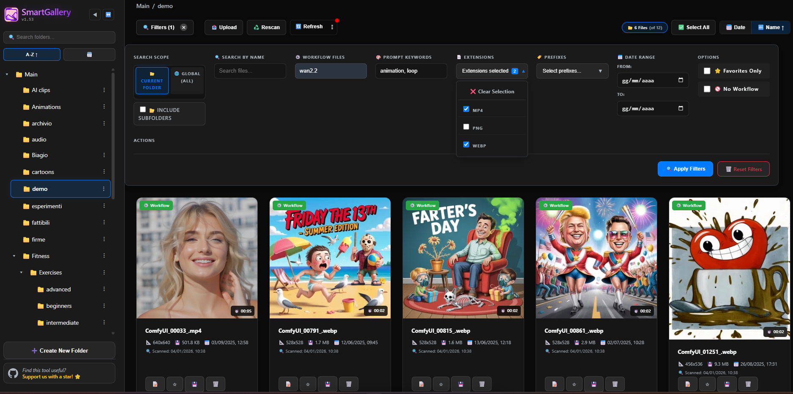
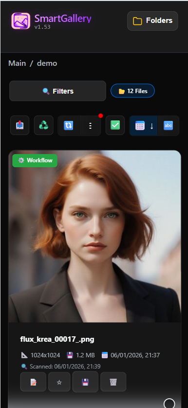
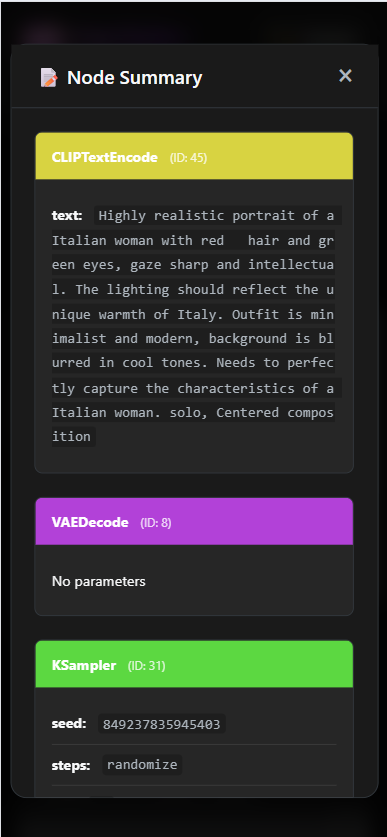

<div align="center">

  <h1>SmartGallery for ComfyUI</h1>
  
  
  
  <p>
    A lightweight, local, browser-based gallery that remembers<br>
    <strong>exactly how every image or video was generated</strong>.
  </p>

  <p>
    <a href="LICENSE"></a>
    
    <a href="https://github.com/biagiomaf/smart-comfyui-gallery/stargazers">
      
    </a>
  </p>

</div>

---

## What is SmartGallery?

**SmartGallery** turns your ComfyUI output folder into a fast, searchable, mobile-friendly web gallery.

Every generated file (image or video) is automatically linked to its **exact ComfyUI workflow**, even if:
- ComfyUI is not running
- the file was generated weeks or months ago
- filenames are meaningless

Everything runs **fully offline**, locally, with no cloud and no tracking. 
 
**Who is this for?**  
ComfyUI users who generate a lot, iterate fast, and want to *never lose a workflow again*.

---

## Why it exists

If you use ComfyUI seriously, you probably faced this:

- Thousands of outputs with generic filenames
- Forgotten workflows
- Hard to search by what you actually remember
- No usable way to browse from your phone

SmartGallery turns your output folder into a **living memory of your creative process**.

---

## Screenshots
<div align="center">
  <!-- Sezione Desktop Gallery -->
  <table style="border-collapse: collapse; width: 100%;">
    <!-- Titolo Desktop con effetto grigetto -->
    <tr>
      <td align="center"><strong>Desktop Interface</strong></td>
    </tr>
    <!-- Immagine Desktop -->
    <tr>
      <td align="center" style="padding: 10px;">
        
      </td>
    </tr>
    <!-- Riga Didascalia Desktop (Tecnica adottata per Node Summary) -->
    <tr>
      <td align="center" style="vertical-align: top; padding: 10px;">
        <em>Fast, clean desktop gallery with workflow-aware search</em>
      </td>
    </tr>
  </table>

  <br> <!-- Spazio tra le due tabelle -->

  <!-- Sezione Mobile Gallery -->
  <table style="border-collapse: collapse; width: 100%;">
    <!-- Riga 1: Titoli (Effetto rettangolo grigio) -->
    <tr>
      <td align="center" width="50%"><strong>Mobile Interface</strong></td>
      <td align="center" width="50%"><strong>Node Summary</strong></td>
    </tr>
    <!-- Riga 2: Immagini allineate al TOP -->
    <tr>
      <td align="center" style="vertical-align: top; padding: 10px;">
        
      </td>
      <td align="center" style="vertical-align: top; padding: 10px;">
        
      </td>
    </tr>
    <!-- Riga 3: Didascalie -->
    <tr>
      <td align="center" style="vertical-align: top; padding: 10px;">
        <em>Fully usable on mobile</em>
      </td>
      <td align="center" style="vertical-align: top; padding: 10px;">
        <em>Instant workflow recall with visual node summary</em>
      </td>
    </tr>
  </table>
</div>

---

## Core Features
- Search with powerful filters: prompt keywords, specific models/LoRAs, file extension, recursive folder scanning, date range, and more
- Full workflow access for PNG, JPG, WebP, and MP4: view node summary, copy to clipboard, or download as JSON
- Upload external files to add them to your collection and retrieve their workflow
- "Auto-Watch" mode to automatically refresh the gallery when new files appear
- Batch operations (delete, move, re-scan)
- Full folder management directly from the UI
- Fully offline and local — works even when ComfyUI is not running
- Cross-platform: Windows, Linux, macOS + Docker

---

**Actively developed** — frequent updates focused on real ComfyUI workflows.  

## What’s New in v1.53
- Native preview support for ProRes `.mov` files (optimized for macOS)
- "Auto-Watch Folder": configurable interval to automatically refresh the gallery when new files appear  
- Shortcut 'C': Copy the current image's workflow metadata to the clipboard  
- Recursive search with persistent filters  
- Modernized dark / glass UI  
- Seamless infinite scrolling  
- Fully collapsible folder sidebar  
- Improved mobile-first responsive layout  

This is a curated summary — see the 👉 full [CHANGELOG](CHANGELOG.md) for all technical changes.

---

## Installation & Update  
## - Windows, macOS, Linux, Docker  

<details>
<summary><strong>Select your platform</strong></summary>

Each quick install shows **only the relevant steps for that platform**.

---

<details>
<summary><strong>Windows (Python)</strong></summary>

### 1. Install

**Option A: Using Git (Recommended)**
```bat
git clone https://github.com/biagiomaf/smart-comfyui-gallery
cd smart-comfyui-gallery
```

**Option B: No Git (Manual Download)**

Download the latest **Source code (zip)** from [**Releases**](https://github.com/biagiomaf/smart-comfyui-gallery/releases/latest), extract it, and open a terminal inside the folder.

**Then, setup the environment:**
```bat
python -m venv venv
venv\Scripts\activate
pip install -r requirements.txt
```

### 2. Run (Best Practice)

Create a new file named `run_smartgallery.bat` inside the folder and paste this content.

**⚠️ IMPORTANT:** Replace the example paths with your real paths. Use forward slashes `/` even on Windows.
```bat
@echo off
cd /d %~dp0
call venv\Scripts\activate.bat

:: --- CONFIGURATION ---
:: REPLACE these paths with your actual folders.
:: NOTE: Use forward slashes (/) for paths (e.g., C:/ComfyUI/output)

set "BASE_OUTPUT_PATH=C:/Path/To/ComfyUI/output"
set "BASE_INPUT_PATH=C:/Path/To/ComfyUI/input"
set "BASE_SMARTGALLERY_PATH=C:/Path/To/ComfyUI/output"

:: If ffmpeg is not in your system PATH, point to ffprobe.exe here:
set "FFPROBE_MANUAL_PATH=C:/Path/To/ffmpeg/bin/ffprobe.exe"
set SERVER_PORT=8189

:: --- START ---
python smartgallery.py
pause
```

Double-click `run_smartgallery.bat` to start.

### 3. How to Update

If you installed via Git:
```bat
cd smart-comfyui-gallery
git pull
venv\Scripts\activate
pip install -r requirements.txt
```

If you downloaded the ZIP: Download the new version, extract it, and copy your `run_smartgallery.bat` into the new folder.

</details>

---

<details>
<summary><strong>macOS (Python)</strong></summary>

### 1. Install

**Option A: Using Git (Recommended)**
```bash
git clone https://github.com/biagiomaf/smart-comfyui-gallery
cd smart-comfyui-gallery
```

**Option B: No Git (Manual Download)**

Download the latest **Source code (tar.gz)** from [**Releases**](https://github.com/biagiomaf/smart-comfyui-gallery/releases/latest), extract it, and open a terminal inside the folder.

**Then, setup the environment:**
```bash
python3 -m venv venv
source venv/bin/activate
pip install -r requirements.txt
```

### 2. Run (Best Practice)

Create a file named `run_smartgallery.sh`, make it executable (`chmod +x run_smartgallery.sh`), and paste this content:
```bash
#!/bin/bash
source venv/bin/activate

# Increase open files limit (fix for "Too many open files" on macOS)
ulimit -n 4096

# --- CONFIGURATION ---
# REPLACE these paths with your actual folders.
export BASE_OUTPUT_PATH="$HOME/ComfyUI/output"
export BASE_INPUT_PATH="$HOME/ComfyUI/input"
export BASE_SMARTGALLERY_PATH="$HOME/ComfyUI/output"

# Ensure ffprobe is installed (brew install ffmpeg)
export FFPROBE_MANUAL_PATH="/usr/bin/ffprobe"
export SERVER_PORT=8189

# --- START ---
python smartgallery.py
```

Run it with: `./run_smartgallery.sh`

### 3. How to Update
```bash
cd smart-comfyui-gallery
git pull
source venv/bin/activate
pip install -r requirements.txt
```
If you downloaded the tar.gz: Download the new version, extract it, and copy your `run_smartgallery.sh` into the new folder.

</details>

---

<details>
<summary><strong>Linux (Python)</strong></summary>

### 1. Install

**Option A: Using Git (Recommended)**
```bash
git clone https://github.com/biagiomaf/smart-comfyui-gallery
cd smart-comfyui-gallery
```

**Option B: No Git**

Download **Source code** from [**Releases**](https://github.com/biagiomaf/smart-comfyui-gallery/releases/latest).

**Then, setup the environment:**
```bash
python3 -m venv venv
source venv/bin/activate
pip install -r requirements.txt
```

### 2. Run (Best Practice)

Create a file named `run_smartgallery.sh`, make it executable (`chmod +x run_smartgallery.sh`), and paste this content:
```bash
#!/bin/bash
source venv/bin/activate

# --- CONFIGURATION ---
# REPLACE these paths with your actual folders.
export BASE_OUTPUT_PATH="$HOME/ComfyUI/output"
export BASE_INPUT_PATH="$HOME/ComfyUI/input"
export BASE_SMARTGALLERY_PATH="$HOME/ComfyUI/output"
export FFPROBE_MANUAL_PATH="/usr/bin/ffprobe"
export SERVER_PORT=8189

# --- START ---
python smartgallery.py
```

Run it with: `./run_smartgallery.sh`

### 3. How to Update
```bash
cd smart-comfyui-gallery
git pull
source venv/bin/activate
pip install -r requirements.txt
```
If you downloaded the source code manually: Download the new version, extract it, and copy your `run_smartgallery.sh` into the new folder.

</details>

---

<details>
<summary><strong>Docker</strong></summary>

### 1. Run

Replace the paths on the left side of the `:` with your actual host paths.
```bash
docker run \
  --name smartgallery \
  -v /your/host/output:/mnt/output \
  -v /your/host/input:/mnt/input \
  -v /your/host/SmartGallery:/mnt/SmartGallery \
  -e BASE_OUTPUT_PATH=/mnt/output \
  -e BASE_INPUT_PATH=/mnt/input \
  -e BASE_SMARTGALLERY_PATH=/mnt/SmartGallery \
  -p 8189:8189 \
  -e WANTED_UID=`id -u` \
  -e WANTED_GID=`id -g` \
  mmartial/smart-comfyui-gallery
```

### 2. How to Update
```bash
# 1. Pull the latest image
docker pull mmartial/smart-comfyui-gallery

# 2. Stop and remove the old container
docker stop smartgallery && docker rm smartgallery

# 3. Run the 'docker run' command again (see above)
```

### 🐳 Docker Deployment 

Want to run SmartGallery in a containerized environment? We've got you covered!

> 🎖️ **Special Thanks**: A huge shout-out to **[Martial Michel](https://github.com/mmartial)** for orchestrating the Docker support and contributing to the core application logic.

Docker deployment provides isolation, easier deployment, and consistent environments across different systems. However, it requires some familiarity with Docker concepts.

**🗄️ Pre-built images**

Pre-built images are available on DockerHub at [mmartial/smart-comfyui-gallery](https://hub.docker.com/r/mmartial/smart-comfyui-gallery) and Unraid's Community Apps. 


**Full Docker guide:** 👉 [docs/DOCKER_HELP.md](DOCKER_HELP.md)


</details>

</details>

---

### - Open SmartGallery

```
http://127.0.0.1:8189/galleryout
```

---

For advanced configuration: 👉 [Complete Installation Guide](docs/installation.md) (Docker Compose, reverse proxy, ffmpeg, scripts, and more)

---

## Experimental Features

**Testing cutting-edge features before official releases?**

The [`/experiments`](experiments/) folder contains beta versions and hotfixes under active development.

⚠️ **Experimental code — use at your own risk. Always backup before testing.**

---

## Optional AI Features (Planned)

SmartGallery is designed to stay **lightweight by default**.

Advanced AI-powered features (semantic search, natural language queries) will be provided by a **separate optional service**:

* Fully optional
* Runs locally
* Separate Docker container or Python environment
* No impact on the core gallery if not installed

The AI service is currently **under development and not released yet**.

---

## Philosophy

* Local-first
* Privacy-first
* Minimal dependencies
* No forced upgrades
* No vendor lock-in

---

## Contributing & Feedback

Issues, ideas, and pull requests are welcome.

* [Open an issue](../../issues)
* Fork → branch → PR

---

## ⭐ Support the Project

If SmartGallery improves your ComfyUI workflow, consider giving the repository a ⭐.

It helps visibility, motivates future development, and costs nothing.

---

## License

MIT License — see [LICENSE](LICENSE)

---

<p align="center">
  <em>Made for the ComfyUI community</em>
</p>

