<div align="center">
  <br><br>
  <a href="LICENSE"></a>
  
  <a href="https://hub.docker.com/r/mmartial/smart-comfyui-gallery"></a>
  <a href="https://github.com/biagiomaf/smart-comfyui-gallery/stargazers"></a>
</div>

# SmartGallery DAM

**The local-first Digital Asset Manager that works with ComfyUI, and survives without it.**

Search 50,000 generations by prompt, model, LoRA, or comments in milliseconds.  
Organize your gallery seamlessly across physical folders and virtual collections.  
Share curated work with clients without exposing a single node, and let them rate and comment on your creations.  
Compare two generations side-by-side with an automatic parameter diff.  
Cull batches from your laptop or also from your phone while ComfyUI is still generating.  

[**smartgallerydam.com**](https://smartgallerydam.com) · full documentation, wiki and feature reference

---

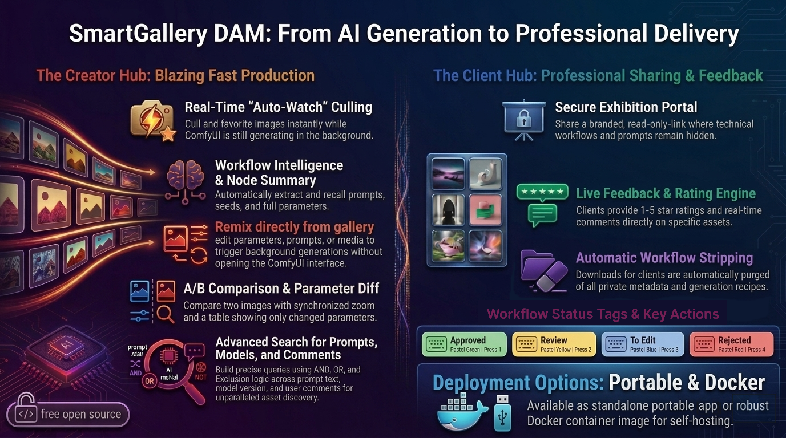

---

## ComfyUI-Aware. ComfyUI-Independent.

SmartGallery DAM runs as a fully independent process, outside ComfyUI's environment. It keeps indexing and organizing your library whether ComfyUI is up, down, updating, or completely uninstalled. No custom node, no shared dependencies.

SmartGallery DAM is *ComfyUI-aware* (it reads workflows, extracts prompts, understands models and LoRAs) but *ComfyUI-independent* by design. Your DAM outlives any tool it connects to.

**What this means in practice:**

- ComfyUI is broken after a Python update? SmartGallery keeps running.
- Run it alongside ComfyUI on the same machine on a different port. Or install it on a separate machine or laptop and just link the output folder over the network.
- You switched tools entirely? SmartGallery works on *any* folder of media. It was never ComfyUI-only to begin with.

---

## The Best Mobile Experience in Its Class

> **We are not aware of any other self-hosted media manager with a mobile interface this good.**

SmartGallery DAM was built responsive from day one, not as an afterthought. 

This is cross-platform in the full sense: **Windows, macOS, Linux, Docker**, accessible from any browser on any device on your network, including tablets and smartphones.

---

## Why SmartGallery?
| | |
|---|---|
| 🔍 **Find anything instantly** | Search by prompt keyword, checkpoint, LoRA, date or comment across tens of thousands of files | 
| 🗂️ **Powerful file manager** | Rename, move, copy, delete files and create folders directly from the browser |
| 🔗 **Works on any folder** | Point it at any ComfyUI output, photo archive, NAS volume or network path. Mix and match as many folders as you want |
| 👥 **Built for teams too** | Role-based access, per-image comments with visibility control, 1 to 5 star ratings |
| 🗃️ **Virtual collections** | Group files from different folders into albums without moving anything on disk. Mark as private or ready for client sharing |
| 🏷️ **Color-coded status tags** | Mark files as Approved, Review, To Edit, Rejected or Select. Browse any status across your entire library at once, standard DAM pipeline workflow |
| 🛡 **Share without exposing your process** | Clients access a dedicated Exhibition portal you launch only when needed. They see curated collections only. Workflows, prompts and models are always hidden |
| ⚖️ **Compare generations** | A/B slider with synchronized zoom and an automatic parameter diff table | 
| 🎬 **Full video support** | Thumbnails, storyboard preview, and on-the-fly transcoding via FFmpeg. Handles ProRes and other professional formats |
| 🌐 **Truly cross-platform** | Windows, macOS, Linux, Docker. Same interface, same features, every OS and device | 
| 📱 **Best-in-class mobile UI** | Full DAM features on your phone. Rate, tag, cull and comment from any device on your network |

---

## Table of Contents

1.  [**OVERVIEW & CONCEPTS**](#1-overview--concepts)
    *   [1.1 What is SmartGallery DAM?](#11-what-is-smartgallery-dam)
    *   [1.2 What's New in v2](#12-whats-new-in-v2)
    *   [1.3 Core Features](#13-core-features)
    *   [1.4 Use Case Scenarios](#14-use-case-scenarios)
2.  [**SETUP & CONFIGURATION**](#2-setup--configuration)
    *   [2.1 Installation](#21-installation)
    *   [2.2 Launch Parameters](#22-launch-parameters)
    *   [2.3 FFmpeg Integration](#23-ffmpeg-integration)
3.  [**INTERFACE WALKTHROUGH**](#3-interface-walkthrough)
    *   [3.1 The Main Workspace (Creator Hub)](#31-the-main-workspace-creator-hub)
    *   [3.2 Advanced Media Inspection](#32-advanced-media-inspection)
    *   [3.3 Digital Asset Management (DAM) & Communication](#33-digital-asset-management-dam--communication)
    *   [3.4 User Management & Access Control](#34-user-management--access-control)
    *   [3.5 The Exhibition Portal (Client Hub)](#35-the-exhibition-portal-client-hub)
4.  [**ADVANCED TOPICS & REFERENCE**](#4-advanced-topics--reference)
    *   [4.1 Sharing Online](#41-sharing-online)
    *   [4.2 Keyboard Shortcuts Reference](#42-keyboard-shortcuts-reference)
    *   [4.3 Experimental Features](#43-experimental-features)
    *   [4.4 Philosophy, Feedback & License](#44-philosophy-feedback--license)

---

## 1. OVERVIEW & CONCEPTS

### 1.1 What is SmartGallery DAM?

**SmartGallery DAM** is the evolution of *SmartGallery for ComfyUI*, a project that started as a fast local gallery for browsing ComfyUI outputs and has grown into a powerful and easy to use **Digital Asset Management system**, suitable for AI artists, digital creators and creative studios.

**Who is this for?**

**The AI Artist.** You run ComfyUI all day. Your output folder has tens of thousands of files and you can never find anything. SmartGallery lives outside that chaos. It indexes every generation with its full workflow, lets you search by prompt, model or LoRA, and lets you cull while batches are still running. When ComfyUI breaks, SmartGallery doesn't even blink.

**The Creative Pro or Team.** You deliver AI visuals to clients. Sharing via Google Drive or Dropbox feels unprofessional. SmartGallery gives you an optional Exhibition portal where clients rate and comment on images in real time, while your prompts and workflows stay completely invisible to them. Launch it only when you have a delivery to share.

**Everyone else.** You just want to organize photos, videos, or art and share them nicely. SmartGallery works with any folder on your system.  

**The Remote or Multi-Machine User.** You want your gallery on a dedicated machine (a laptop, a NAS, a home server) without installing ComfyUI there. Install SmartGallery on that machine, link your ComfyUI output folder over the network, and access the full DAM from any browser, on any device, including your phone.

---

### 1.2 What's New in v2.11

v2 is not just a feature drop. The version number jumped because the architecture, ACL system, and multi-user logic required a ground-up rethink. **Your existing setup, folders, and data are all forward-compatible**.

**New in v2.11:**

-   **Powerful search operators:** filter by multiple keywords at once using AND, OR and exclusion operators across prompts, models, LoRAs, comment text and more.
-   **Virtual Collections (Exhibition Ready / Private):** group files from different physical folders into named albums without moving anything on disk. Mark a collection as Exhibition Ready to make it visible in the sharing portal. Private collections are invisible to guests and never appear in Exhibition.
-   **1-5 Star Ratings:** rate any image from 1 to 5 stars. Works for solo users too: a great way to personally curate your own library and surface your best work. Ratings are per-user, a global average is shown instantly in the grid, and you can sort by highest rated.
-   **Real-Time Comments:** leave notes on any image, whether you work alone or with a team. Solo users can annotate their own files as personal memos. With a team, each message has its own visibility: Public (everyone), Internal (staff only), or Direct Message to a specific user. Comment keywords are fully searchable from the Filters panel. Press `G` on any image to open the details panel.
-   **Color-Coded Status Tags:** tag any image with a pipeline state using keys `1` to `5`: Approved (green), Review (yellow), To Edit (blue), Rejected (red), Select (purple). Browse all files carrying a given status across every folder at once from the Status tab in the sidebar.
-   **Full User Management with ACL Roles:** create accounts and assign roles: Admin, MANAGER, STAFF, FRIEND, USER, CUSTOMER, GUEST. Each role controls which interface they can access, what they can see, and what they can download.
-   **Exhibition Mode (fully optional):** a separate, read-only portal you can launch when you want to share work with clients, collaborators, or friends. Completely optional: if you have no need to share, simply never launch it. Only the collections you mark as Exhibition Ready are visible. Workflows and prompts are always hidden from guests.
-   **Clean Export (`Shift+W`):** download any file stripped of all embedded workflows, prompts and EXIF metadata. Safe to send to anyone without exposing your process.
-   **Mount Any External Drive or Folder:** (improved) mount external drives, NAS volumes or network paths directly from the UI. Mix ComfyUI output folders with photo archives, video collections or any other media library. All DAM features work on everything, workflow extraction only applies where there is a workflow to extract.
-   **Wiki Website:** Full documentation with screenshots at [smartgallerydam.com](https://smartgallerydam.com) (accessible from the top menu: "Docs").  

---

### 1.3 Core Features

<details>
<summary><strong>Live Workspace and File Management</strong></summary>

-   **Cross-platform, Cross-device:** Runs locally on Windows, macOS, Linux, and Docker. The responsive web interface works flawlessly across desktops, tablets, and smartphones. Work from your studio machine or cull batches from your phone on the couch.
-   **Auto-Watch:** detects new ComfyUI outputs the moment they are saved. Cull with `Del`, favorite with `F`, move with `M`, all while generation is still running. Your scroll position is never disturbed.
-   **Full File Manager:** select files individually or in bulk (Shift+Click range select, Ctrl+A select all). Move, copy, delete, or ZIP directly from the browser.
-   **Upload External Files:** import images generated elsewhere. If they contain embedded ComfyUI metadata, SmartGallery extracts and displays the full workflow automatically.
-   **Focus Mode:** press `Q` to hide all UI chrome. Maximum screen space for pure curation.
-   **Compact Thumbnails:** toggle grid density via the Options menu.
-   **External Drive Mounting:** link any external drive, NAS, or network path via Symlinks directly from the UI. The folder appears in your sidebar alongside your ComfyUI folders.
-   **Fully Offline:** works perfectly even when ComfyUI is not running or completely uninstalled.

</details>

<details>
<summary><strong>Workflow Intelligence (ComfyUI)</strong></summary>

-   **Node Summary Dashboard:** press `N` on any image to see Seed, CFG, Steps, Sampler, Scheduler, all active Models, LoRAs with weights, and full positive/negative prompts.
-   **Workflow Download and Copy:** press `W` to download the raw JSON workflow, `C` to copy it to clipboard and paste directly back into ComfyUI.
-   **Clean Export:** press `Shift+W` to download a pixel-perfect copy stripped of all EXIF data and embedded workflows. Safe to share externally without exposing your process.
-   **Compare Mode:** select two generations, open the A/B slider with synchronized zoom and pan. A parameter diff table shows only the values that changed: Seed, CFG, LoRA weights, sampler, anything.

</details>

<details>
<summary><strong>Organization (DAM)</strong></summary>

-   **Virtual Collections:** group files from different physical folders into albums without duplicating a byte on disk. Mark as Exhibition Ready to expose in Exhibition, keep Private for internal use only.
-   **Status Tags:** keyboard shortcuts `1` to `5` apply color-coded team statuses: Approved, Review, To Edit, Rejected, Select. Browse all files in a given status across every folder at once from the Status tab.
-   **Favorites:** press `F` to toggle a Favorite flag on any file. Filter to Favorites-only from the search panel.

</details>

<details>
<summary><strong>Search and Filtering</strong></summary>

-   Search by **prompt keywords**, **checkpoint name**, **LoRA name**, **comment text**, date range, file extension.
-   Scope to the current folder or search the **global database** instantly.  
-   Filter by multiple keywords at once using AND, OR and exclusion operators across prompts, models, LoRAs, comment text and more
-   Sort by date, name, rating, or comment count, ascending or descending. A dedicated **Last Commented** sort orders files by the most recent comment activity, newest first: useful for Admin and Staff to instantly surface the latest client, guest, or friend feedback without manually hunting through the grid.
-   Filter by Favorites only, or by files with no embedded workflow.

</details>

<details>
<summary><strong>Media Tools</strong></summary>

-   **Video Storyboard:** press `E` in the Lightbox to generate a grid of 11 evenly-spaced frames from start to last frame. Instant video review without scrubbing.
-   **Video Transcoding:** ProRes, MKV, AVI, MOV are auto-transcoded via FFmpeg for smooth browser playback.
-   **Smart Video Grid:** videos strictly pause when they leave the viewport, reducing CPU/GPU usage significantly.
-   **Video Autoplay Toggle:** press `P` to enable/disable autoplay. Default: off.

</details>

<details>
<summary><strong>Exhibition Mode and Collaboration</strong></summary>

-   **Exhibition Mode (fully optional):** a separate, secure portal for clients, collaborators, friends, or family. Launch it only when you need it, on a separate port, independently from the Main Interface. Physical folder browsing is disabled. Only Exhibition Ready collections are visible. All workflows and EXIF data are stripped automatically before any download. Solo users with no sharing needs can ignore this entirely.
-   **1-5 Star Ratings:** per-image, per-user. Global average displayed in the grid. Searchable and sortable.
-   **Comments and Feedback:** every image has a comment thread where anyone with access can post messages, leave feedback, or exchange notes with the team. When writing a message, a visibility selector lets the author choose exactly who will see it. Public messages are visible to everyone. Internal messages go only to Staff. Direct Messages target a specific registered user and are visible only to that person and Staff.
-   **Multi-User ACL:** Admin, MANAGER, STAFF, FRIEND, USER, CUSTOMER, GUEST roles. Main interface access restricted to Admin, MANAGER, STAFF. Exhibition for all others.
-   **Guest Login:** optional anonymous access with `--enable-guest-login`. No account required to browse.

</details>

---

### 1.4 Use Case Scenarios

SmartGallery has two interfaces: the **Main Interface** (your personal workspace) and **Exhibition** (an optional sharing portal for clients, collaborators, or friends). They are completely independent. You can run just the Main Interface forever and never touch Exhibition. You can launch Exhibition only when you have something to share and shut it down when the review is over. Neither requires the other to be running.

<details>
<summary><strong>Scenario 1: Solo user, no sharing needed (upgrading from v1)</strong></summary>

If you used SmartGallery v1 as an advanced file manager and have no need to share your work, nothing changes. Launch it exactly as before, with no extra parameters:

```bash
python smartgallery.py
```

ComfyUI is generating hundreds of files. As each one appears in the grid, you decide in real time: delete the bad seeds immediately with `Del`, move the keepers to the right folder with `M`, mark favorites with `F`, or tag them with a color status. You do all of this while generation is still running. When you want to review later, you search by prompt keywords, model name, or LoRA, pull up the full node summary for any image from months ago, or compare two generations side by side with a parameter diff.

When ComfyUI is not running, the same interface works as a full file manager for all your media. No Exhibition needed, ever, unless you decide you want it.

What is new in v2 that you can start using immediately, with no additional setup:

-   **Virtual Collections:** group files from different folders into named albums without moving anything on disk. Open the Collections tab in the left sidebar and click + to create one.
-   **Status Tags:** mark any image with a workflow state using keys `1` to `5`. For example, press `3` to flag a file as "To Edit" and come back to it later. Browse all files with a given status from the Status tab in the sidebar.
-   **Ratings and personal notes:** press `G` on any image to open the Details panel. Assign a 1 to 5 star rating and write a note to yourself. These notes are searchable: use the comment keyword filter to find any image by words you wrote in your own comments.
-   **Clean Export:** to send a file to someone without exposing your ComfyUI workflow and models, press `Shift+W`. You get a pixel-perfect copy with all metadata stripped.

</details>

<details>
<summary><strong>Scenario 2: Sharing your work with Exhibition</strong></summary>

Exhibition is a separate, read-only portal you share with clients, collaborators, or anyone you want to show your work to.

**Step 1: Launch the Main Interface with authentication.**

> The line below shows only the launch command with the relevant parameters. In practice you should add these parameters to your platform launch script (the `.bat` or `.sh` file you created during installation), which also sets your folder paths and ffprobe location. If you have not created a launch script yet, see the [Installation](#21-installation) section, pick your platform, and follow the instructions there first.

```bash
python smartgallery.py --port 8189 --admin-pass yourpassword --force-login
```

Log in at `http://localhost:8189` with username `admin` (always lowercase) and the password you set above.

**Step 2: Create Collections and mark them as Exhibition Ready.** In the left sidebar, open the Collections tab and click +. Give each collection a name (Interiors, Exteriors, Project X, or whatever fits) and toggle it as Exhibition Ready to make it visible in Exhibition. You can change this at any time. Add files to the collections you want to expose.

**Step 3: Create user accounts.** Click the user management icon in the sidebar. Create an account for each person who will access Exhibition. For clients and external viewers, assign the role CUSTOMER or USER. Share their credentials and the Exhibition URL with them directly.

**Step 4: Launch Exhibition.**

> Same as above: add these parameters to a second launch script for Exhibition (a separate `.bat` or `.sh` file), keeping your folder paths and other settings identical to the Main Interface script. Run it from a second terminal when you are ready to share.

```bash
python smartgallery.py --exhibition --port 8190 --admin-pass yourpassword
```

Share `http://youraddress:8190` with your users. They will see only the Exhibition Ready collections, with no prompts, no workflow data, and no folder structure. They can leave star ratings and write comments on individual images. You can read and reply to their feedback from the Main Interface at any time, and they will see your reply the next time they log in.

You do not need to run both instances at the same time permanently. Launch Exhibition only when you have something to share, and shut it down when the review session is over. All other paths and settings you already have configured remain unchanged.

</details>

<details>
<summary><strong>Scenario 3: Small team working together</strong></summary>

The team lead runs the Main Interface with `--force-login` and `--admin-pass` so the workspace is password-protected. Each team member gets a STAFF account and logs into the same Main Interface remotely to review files, apply status tags, and leave internal comments on specific images.

```bash
python smartgallery.py --port 8189 --admin-pass yourpassword --force-login
```

Log in at `http://localhost:8189` with username `admin` (always lowercase) and the password you set above. Create STAFF accounts from the user management panel and share the URL with your team.

When work is ready for a client, a CUSTOMER account is created, the relevant Collections are marked as Exhibition Ready, and Exhibition is launched on a separate port:

```bash
python smartgallery.py --exhibition --port 8190 --admin-pass yourpassword
```

Share `http://youraddress:8190` with the client. They get a clean view with no access to the production workspace, no prompts, no workflow data. They can leave star ratings and comments on individual images. Admin, MANAGER, and STAFF can log into Exhibition too to see exactly what the client sees, and reply to their feedback from either interface.

All feedback runs through the same database, with no file transfers, no email threads, and no ZIP files.

</details>

---

## 2. SETUP & CONFIGURATION

### 2.1 Installation

**Requirements:** Python 3.9+ · FFmpeg/FFprobe (recommended for video) · Windows, macOS, Linux or Docker. ComfyUI does **not** need to be running.

<details>
<summary><strong>Windows</strong></summary>

There are two ways to run SmartGallery on Windows: using the ready-to-use **Portable Version** (Recommended) or the **Manual Git Installation**.

---

### Method 1: Portable Version (Recommended)
This version includes a fully self-contained embedded Python environment (Python 3.12). You do not need to install Python on your system to use it.

**1. Download & Extract**
* Download the Portable ZIP from the [Releases page](https://github.com/biagiomaf/smart-comfyui-gallery/releases/latest). 
*(Direct link to the v2.11 build: [SmartGallery-v2.11-Windows-Portable.zip](https://github.com/biagiomaf/smart-comfyui-gallery/releases/download/2.11/SmartGallery-v2.11-Windows-Portable.zip))*
* Extract the `.zip` archive into a folder of your choice.

**2. Configure and Run**
* Please read the `README_PORTABLE.txt` included in the folder.
* Right-click on the `run_smartgallery.bat` file and select **Edit**.
* Modify the paths in the `CONFIGURATION` section to point to your real ComfyUI folders (remember to use forward slashes `/`).
* Save the file and double-click `run_smartgallery.bat` to launch the server!

**3. Update the Portable Version**
To update to a newer version in the future, just download the new Portable ZIP, extract it, and overwrite the files. **Make sure to copy your old `run_smartgallery.bat`** into the new folder so you don't lose your path configurations!

---

### Method 2: Manual / Git Installation
For advanced users who prefer managing their own Python virtual environments and updating via Git.

**1. Clone and setup**

```bat
git clone https://github.com/biagiomaf/smart-comfyui-gallery
cd smart-comfyui-gallery
python -m venv venv
venv\Scripts\activate
pip install -r requirements.txt
```

Or download the Source Code ZIP from [Releases](https://github.com/biagiomaf/smart-comfyui-gallery/releases/latest), extract, and run the pip commands above.

**2. Create your launch script**

Create `run_smartgallery.bat` in the root folder:

```bat
@echo off
cd /d %~dp0
call venv\Scripts\activate.bat

:: --- CONFIGURATION: replace with your real paths ---
:: Use forward slashes (/) even on Windows
set "BASE_OUTPUT_PATH=C:/Path/To/ComfyUI/output"
set "BASE_INPUT_PATH=C:/Path/To/ComfyUI/input"
set "BASE_SMARTGALLERY_PATH=C:/Path/To/ComfyUI/output"
set "FFPROBE_MANUAL_PATH=C:/Path/To/ffmpeg/bin/ffprobe.exe"
set SERVER_PORT=8189

:: --- OPTIONAL LAUNCH PARAMETERS ---
:: Add any of the following to the python command below depending on your scenario:
::
::   --admin-pass yourpassword   Set the admin password (log in as: admin / yourpassword)
::   --force-login               Require login on the Main Interface (use with --admin-pass)
::   --exhibition                Start in Exhibition Mode instead of the Main Interface
::   --port 8190                 Use a different port (default: 8189)
::   --enable-guest-login        Allow anonymous guest access in Exhibition
::
:: Example – Main Interface with login enforced:
::   python smartgallery.py --port 8189 --admin-pass yourpassword --force-login
::
:: Example – Exhibition on port 8190:
::   python smartgallery.py --exhibition --port 8190 --admin-pass yourpassword

:: --- START ---
python smartgallery.py
pause
```

Double-click `run_smartgallery.bat` to start.

**3. Update**

```bat
cd smart-comfyui-gallery
git pull
venv\Scripts\activate
pip install -r requirements.txt
```

</details>

<details>
<summary><strong>macOS</strong></summary>

**1. Clone and setup**

```bash
git clone https://github.com/biagiomaf/smart-comfyui-gallery
cd smart-comfyui-gallery
python3 -m venv venv
source venv/bin/activate
pip install -r requirements.txt
```

**2. Create your launch script**

Create `run_smartgallery.sh` and make it executable (`chmod +x run_smartgallery.sh`):

```bash
#!/bin/bash
source venv/bin/activate

# Fix for "Too many open files" on macOS
ulimit -n 4096

# --- CONFIGURATION: replace with your real paths ---
export BASE_OUTPUT_PATH="$HOME/ComfyUI/output"
export BASE_INPUT_PATH="$HOME/ComfyUI/input"
export BASE_SMARTGALLERY_PATH="$HOME/ComfyUI/output"
export FFPROBE_MANUAL_PATH="/opt/homebrew/bin/ffprobe"
export SERVER_PORT=8189

# --- OPTIONAL LAUNCH PARAMETERS ---
# Add any of the following to the python command below depending on your scenario:
#
#   --admin-pass yourpassword   Set the admin password (log in as: admin / yourpassword)
#   --force-login               Require login on the Main Interface (use with --admin-pass)
#   --exhibition                Start in Exhibition Mode instead of the Main Interface
#   --port 8190                 Use a different port (default: 8189)
#   --enable-guest-login        Allow anonymous guest access in Exhibition
#
# Example – Main Interface with login enforced:
#   python smartgallery.py --port 8189 --admin-pass yourpassword --force-login
#
# Example – Exhibition on port 8190:
#   python smartgallery.py --exhibition --port 8190 --admin-pass yourpassword

# --- START ---
python smartgallery.py
```

Run with: `./run_smartgallery.sh`

Install FFmpeg via Homebrew: `brew install ffmpeg`

**3. Update**

```bash
cd smart-comfyui-gallery && git pull
source venv/bin/activate && pip install -r requirements.txt
```

</details>

<details>
<summary><strong>Linux</strong></summary>

**1. Clone and setup**

```bash
git clone https://github.com/biagiomaf/smart-comfyui-gallery
cd smart-comfyui-gallery
python3 -m venv venv
source venv/bin/activate
pip install -r requirements.txt
```

**2. Create your launch script**

Create `run_smartgallery.sh` and make it executable (`chmod +x run_smartgallery.sh`):

```bash
#!/bin/bash
source venv/bin/activate

# --- CONFIGURATION: replace with your real paths ---
export BASE_OUTPUT_PATH="$HOME/ComfyUI/output"
export BASE_INPUT_PATH="$HOME/ComfyUI/input"
export BASE_SMARTGALLERY_PATH="$HOME/ComfyUI/output"
export FFPROBE_MANUAL_PATH="/usr/bin/ffprobe"
export SERVER_PORT=8189

# --- OPTIONAL LAUNCH PARAMETERS ---
# Add any of the following to the python command below depending on your scenario:
#
#   --admin-pass yourpassword   Set the admin password (log in as: admin / yourpassword)
#   --force-login               Require login on the Main Interface (use with --admin-pass)
#   --exhibition                Start in Exhibition Mode instead of the Main Interface
#   --port 8190                 Use a different port (default: 8189)
#   --enable-guest-login        Allow anonymous guest access in Exhibition
#
# Example – Main Interface with login enforced:
#   python smartgallery.py --port 8189 --admin-pass yourpassword --force-login
#
# Example – Exhibition on port 8190:
#   python smartgallery.py --exhibition --port 8190 --admin-pass yourpassword

# --- START ---
python smartgallery.py
```

Run with: `./run_smartgallery.sh`

**3. Update**

```bash
cd smart-comfyui-gallery && git pull
source venv/bin/activate && pip install -r requirements.txt
```

</details>

<details>
<summary><strong>Docker</strong></summary>

> Special thanks to [Martial Michel (@mmartial)](https://github.com/mmartial) for orchestrating Docker support and contributing to the core application logic.

Pre-built image on [DockerHub](https://hub.docker.com/r/mmartial/smart-comfyui-gallery) and **Unraid Community Apps**.

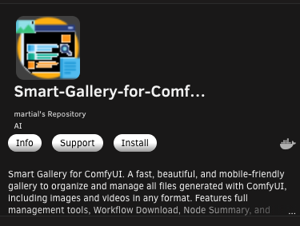

**Run:**

```bash
docker run \
  --name smartgallery \
  -v /your/host/output:/mnt/output \
  -v /your/host/input:/mnt/input \
  -v /your/host/SmartGallery:/mnt/SmartGallery \
  -e BASE_OUTPUT_PATH=/mnt/output \
  -e BASE_INPUT_PATH=/mnt/input \
  -e BASE_SMARTGALLERY_PATH=/mnt/SmartGallery \
  -e WANTED_UID=`id -u` \
  -e WANTED_GID=`id -g` \
  # -e CLI_ARGS="..."   # Optional: add launch parameters here (see below)
  -p 8189:8189 \
  mmartial/smart-comfyui-gallery
```

The `CLI_ARGS` environment variable passes optional launch parameters to SmartGallery inside the container. Add it to the command above depending on your scenario:

| Scenario | CLI_ARGS value | Port mapping |
|---|---|---|
| Main Interface with login enforced | `--admin-pass yourpassword --force-login` | `-p 8189:8189` |
| Exhibition | `--exhibition --admin-pass yourpassword` | `-p 8190:8189` |
| Exhibition with guest access | `--exhibition --admin-pass yourpassword --enable-guest-login` | `-p 8190:8189` |

For Exhibition scenarios, replace `-p 8189:8189` in the `docker run` command above with `-p 8190:8189`. This maps port 8190 on your host to the container's internal port 8189, so clients reach Exhibition at `http://youraddress:8190`.

When using `--admin-pass`, log in with username `admin` (always lowercase) and the password you set.

For running both instances simultaneously, see the dedicated section under [Launch Parameters](#22-launch-parameters).

**Update:**

```bash
docker pull mmartial/smart-comfyui-gallery
docker stop smartgallery && docker rm smartgallery
# Re-run the docker run command above
```

Full Docker guide: [docs/DOCKER_HELP.md](docs/DOCKER_HELP.md)

</details>

Once installed, open SmartGallery at:
```
http://127.0.0.1:8189/galleryout
```
<br>

> [!IMPORTANT]
> **Note on Updates:** When updating from a previous version, always remember to update your virtual environment as well, following the specific instructions for your platform:
>
> ```bash
> pip install -r requirements.txt
> ```

---

### 2.2 Launch Parameters

The Main Interface and Exhibition are completely independent. You can run just one, both at the same time, or alternate between them. Neither requires the other to be running.

<details>
<summary><strong>Main Interface parameters</strong></summary>

All parameters are optional. Launched with no flags, SmartGallery runs on port 8189 and treats you as admin automatically when accessed from a local network.

| Flag | Required | Description |
|---|---|---|
| `--port <number>` | Optional | Override the default port (8189). |
| `--admin-pass <pwd>` | Optional* | Set the Admin password. Required to enable user management. Minimum 8 characters. Log in with username `admin` (always lowercase) and the password you set here. |
| `--force-login` | Optional* | Enforces authentication. Must always be combined with `--admin-pass`. Use when accessing from outside the local network. |

`*` `--admin-pass` and `--force-login` must be used together when either is specified.

> **Accessing the main interface from outside your local network?** Always use `--admin-pass` and `--force-login` together, without exception. Without these two flags the interface is open to anyone who finds the URL.

</details>

<details>
<summary><strong>Exhibition parameters</strong></summary>

| Flag | Required | Description |
|---|---|---|
| `--exhibition` | Yes | Start in Exhibition Mode. Only Exhibition Ready collections are visible. Physical folder browsing is disabled. |
| `--admin-pass <pwd>` | Yes | Set the Admin password. Required to protect the instance and enable user management. Minimum 8 characters. Log in with username `admin` (always lowercase) and the password you set here. |
| `--port <number>` | Yes | Use a different port when running Exhibition alongside the main interface. Typically 8190. |
| `--enable-guest-login` | Optional | Shows a "Login as Guest" button. No account needed to browse Exhibition. |

</details>

<details>
<summary><strong>Running both instances: together or independently</strong></summary>

The two instances can run at the same time from two separate terminals or scripts, or independently whenever needed. Launch Exhibition only when you have something to share. There is no requirement to keep both running permanently.

**Python: two terminals or scripts**

```bash
# Terminal 1: Main interface
python smartgallery.py --port 8189 --admin-pass yourpassword --force-login

# Terminal 2: Exhibition (launch only when needed)
python smartgallery.py --exhibition --port 8190 --admin-pass yourpassword
```

**Docker: same image, launched twice**

```bash
# Main interface container (port 8189 on host)
docker run --name smartgallery-main \
  -v /your/host/output:/mnt/output \
  -v /your/host/input:/mnt/input \
  -v /your/host/SmartGallery:/mnt/SmartGallery \
  -e BASE_OUTPUT_PATH=/mnt/output \
  -e BASE_INPUT_PATH=/mnt/input \
  -e BASE_SMARTGALLERY_PATH=/mnt/SmartGallery \
  -e WANTED_UID=`id -u` \
  -e WANTED_GID=`id -g` \
  -e CLI_ARGS="--admin-pass yourpassword --force-login" \
  -p 8189:8189 \
  mmartial/smart-comfyui-gallery

# Exhibition container (port 8190 on host)
docker run --name smartgallery-exhibition \
  -v /your/host/output:/mnt/output \
  -v /your/host/input:/mnt/input \
  -v /your/host/SmartGallery:/mnt/SmartGallery \
  -e BASE_OUTPUT_PATH=/mnt/output \
  -e BASE_INPUT_PATH=/mnt/input \
  -e BASE_SMARTGALLERY_PATH=/mnt/SmartGallery \
  -e WANTED_UID=`id -u` \
  -e WANTED_GID=`id -g` \
  -e CLI_ARGS="--exhibition --admin-pass yourpassword" \
  -p 8190:8189 \
  mmartial/smart-comfyui-gallery
```

Docker port mapping: the syntax is `HOST:CONTAINER`. Both containers run internally on port 8189, but are reachable at `:8189` and `:8190` respectively on your machine. They share the same data volumes, so files, tags, and collections are visible in both.

</details>

---

### 2.3 FFmpeg Integration

FFmpeg is optional but strongly recommended. Without it, video files will not generate thumbnails, the storyboard feature will not work, and formats like ProRes, MKV, AVI, and MOV will not transcode for browser playback.

If you only work with images, you can skip this entirely.

<details>
<summary><strong>What FFmpeg enables</strong></summary>

-   Thumbnail generation for MP4, WEBM, and all transcoded formats
-   Video Storyboard: the 11-frame grid preview (`E` key in the Lightbox)
-   On-the-fly transcoding of ProRes, MKV, AVI, MOV to a browser-compatible format
-   Workflow extraction from video files generated by ComfyUI

SmartGallery uses `ffprobe` (included in every FFmpeg installation) to read video metadata, and `ffmpeg` itself for transcoding. You point SmartGallery to the `ffprobe` binary via the `FFPROBE_MANUAL_PATH` variable in your launch script.

</details>

<details>
<summary><strong>Install FFmpeg on Windows</strong></summary>

1.  Download a pre-built release from [ffmpeg.org/download.html](https://ffmpeg.org/download.html) (the "Windows builds" section, for example from gyan.dev or BtbN).
2.  Extract the archive to a permanent location, for example `C:/ffmpeg`.
3.  The binaries you need are inside the `bin` folder: `ffmpeg.exe` and `ffprobe.exe`.
4.  In your `run_smartgallery.bat`, set:

```bat
set "FFPROBE_MANUAL_PATH=C:/ffmpeg/bin/ffprobe.exe"
```

You do not need to add FFmpeg to your system PATH. SmartGallery only needs the full path to `ffprobe.exe`.

</details>

<details>
<summary><strong>Install FFmpeg on macOS</strong></summary>

The easiest way is Homebrew:

```bash
brew install ffmpeg
```

After installation, ffprobe will typically be at `/opt/homebrew/bin/ffprobe` (Apple Silicon) or `/usr/local/bin/ffprobe` (Intel). Set it in your launch script:

```bash
export FFPROBE_MANUAL_PATH="/opt/homebrew/bin/ffprobe"
```

To confirm the path on your machine: `which ffprobe`

</details>

<details>
<summary><strong>Install FFmpeg on Linux</strong></summary>

On Debian/Ubuntu:

```bash
sudo apt update && sudo apt install ffmpeg
```

On Fedora/RHEL:

```bash
sudo dnf install ffmpeg
```

ffprobe is installed alongside ffmpeg. The default path is usually `/usr/bin/ffprobe`. Set it in your launch script:

```bash
export FFPROBE_MANUAL_PATH="/usr/bin/ffprobe"
```

To confirm: `which ffprobe`

</details>

<details>
<summary><strong>Docker: nothing to install</strong></summary>

The official Docker image (`mmartial/smart-comfyui-gallery`) already includes FFmpeg and ffprobe. Video transcoding, thumbnail generation, and storyboard creation all work out of the box with no additional configuration.

</details>

---

## 3. INTERFACE WALKTHROUGH

### 3.1 The Main Workspace (Creator Hub)

**Access:** `http://localhost:8189/galleryout`

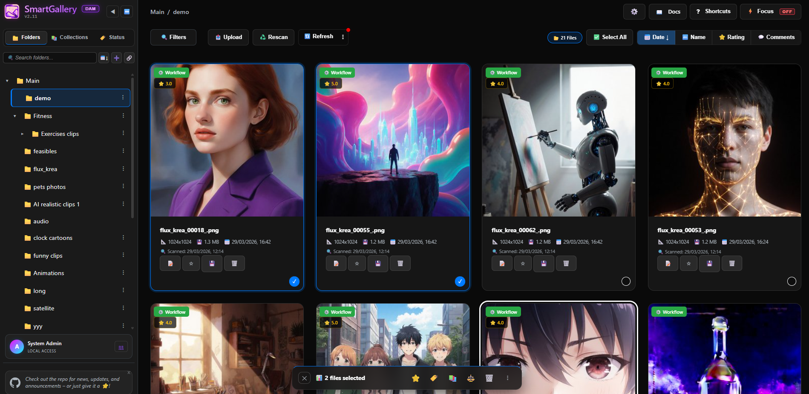
<br><em>The Main Workspace: grid view with sidebar navigation, batch selection bar at the bottom, and Workflow badges on each card. Fully responsive and functional on mobile devices.</em>
<br>
<div align="center">
  <table>
    <tr>
      <td align="center">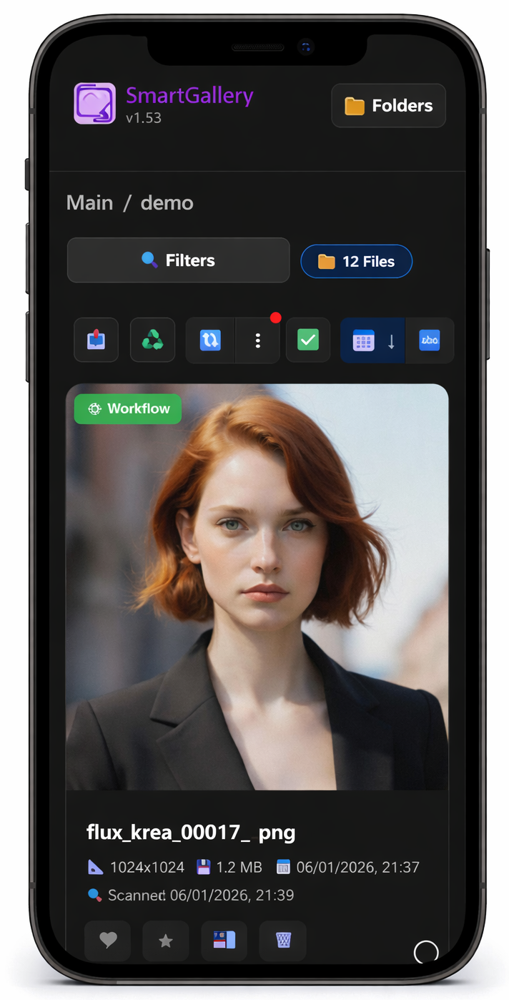</td>
      <td align="center">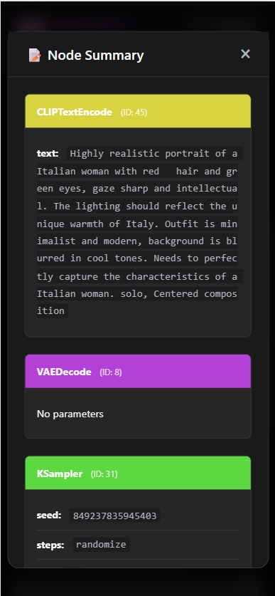</td>
    </tr>
    <tr>
      <td align="center"><em>Mobile interface</em></td>
      <td align="center"><em>Node Summary: full workflow recall at a glance</em></td>
    </tr>
  </table>
</div>

---

### 3.1.1 Sidebar Navigation

The left sidebar contains three main tabs:  

 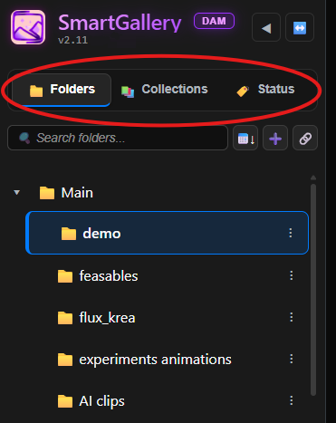

*The three-tab sidebar: Folders (directory tree), Collections (virtual albums), Status (browse by pipeline state).*

-   **📁 Folders (Physical):** Browse actual folders on your hard drive.
    -   `+` — Create a subfolder
    -   🔗 — Mount an external drive or network folder via symlink
    -   `⋮` — Rename, Delete, Unmount, or force AI Indexing on a folder
-   **📚 Collections (Virtual):** Virtual albums grouping files from different folders without moving them on disk.
-   **🏷 Status:** Browse all files by their color-coded pipeline status across every folder at once.
-   **👤 User Profile (bottom):** Shows your current role. Click 👥 to open User Management, `×` to log out.

---

### 3.1.2 Top Toolbar & Global Actions

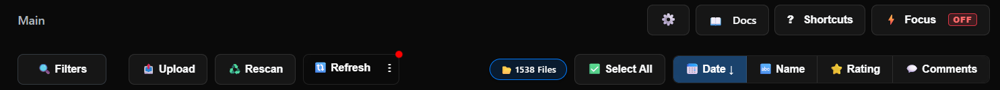

*The top toolbar: action buttons on the left, file count and sort options on the right.*

-   **⚙️ Options:** Global settings — thumbnail size (Normal 320px / Compact 220px), video autoplay.
-   **? Shortcuts:** Full keyboard shortcut list for the current interface.
-   **⚡ Focus (Q):** Toggle Focus Mode.
-   **📤 Upload:** Drag & drop files into the current folder. ComfyUI metadata is extracted automatically.
-   **♻️ Rescan:** Forces a background disk scan for externally added or modified files.

#### Auto-Watch & Refresh

 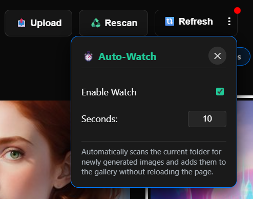

*Auto-Watch: click the `⋮` next to Refresh, enable the toggle and set an interval. A pulsing red dot confirms it's active.*

-   **Manual Refresh:** Click the 🔃 icon to instantly scan for new files.
-   **Auto-Watch (`⋮`):** Silently scans in the background and injects new ComfyUI files into the grid **without a page reload**. Enable it while ComfyUI is generating to cull in real time.

---

### 3.1.3 Search & Filters

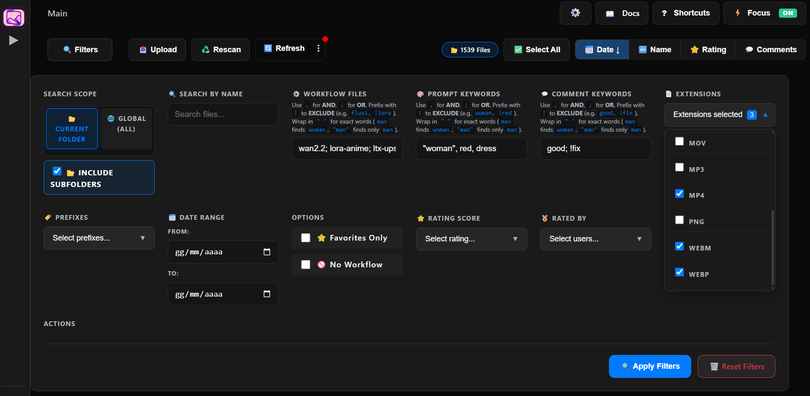

*The Filters panel: search scope, multi-keyword fields, extensions, date range, and options.*

Click **🔍 Filters** to open the advanced search engine. Filters work across both physical Folders and virtual Collections.

**Search Scope:** Current Folder or Global (All Folders). Toggle *Include Subfolders* for recursive search.

**Multi-Keyword Fields** (Workflow Files, Prompt Keywords, Comment Keywords):

| Syntax | Logic | Example |
|---|---|---|
| `,` comma | **AND** — must contain both | `red, car` |
| `;` semicolon | **OR** — contains either | `cat; dog` |
| `!` exclamation | **NOT** — exclude keyword | `!lora`, `!cat` |
| `" "` quotes | **Exact Match** | `"man"` (won't match `woman`) |

*💡 **Pro Tip**: You can combine Exact Matches and Exclusions! Use `!"bad anatomy"` to completely exclude a specific phrase from your search results.*

**Extensions & Prefixes:** Filter by file type or filename prefix.

**Date Range:** Filter by generation/upload date.

**Options:** Favorites Only · No Workflow. 


#### Sort Buttons

Sort by **Date** (📅), **Name** (🔤), **Rating** (⭐), or **Comments** (💬). Clicking Comments twice toggles between *Most Discussed* and *Recent Activity* (newest first) — useful for surfacing the latest client feedback.

---

### 3.1.4 Gallery Grid & Focus Mode

**Standard Grid View (Focus Mode OFF):** Hovering over an image reveals the quick-action card with Node Summary (📝), Favorite (⭐), Download (💾), Delete (🗑️). Clicking opens the Lightbox.

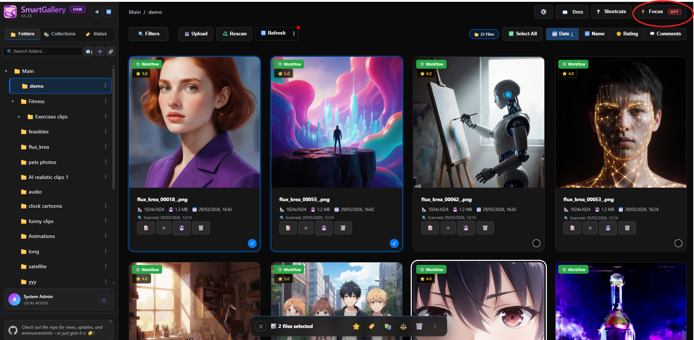

*Standard Grid View (Focus OFF): two files selected (blue checkmarks), hover card visible, batch bar at the bottom.*

**Focus Mode ON (`Q`):** Hides all UI chrome, metadata, titles, and quick-action cards. A golden star marks favorites. Selected items show a massive **fuchsia border**. Use keyboard arrows to navigate. Click or press `V`/`Enter` to open the Lightbox.

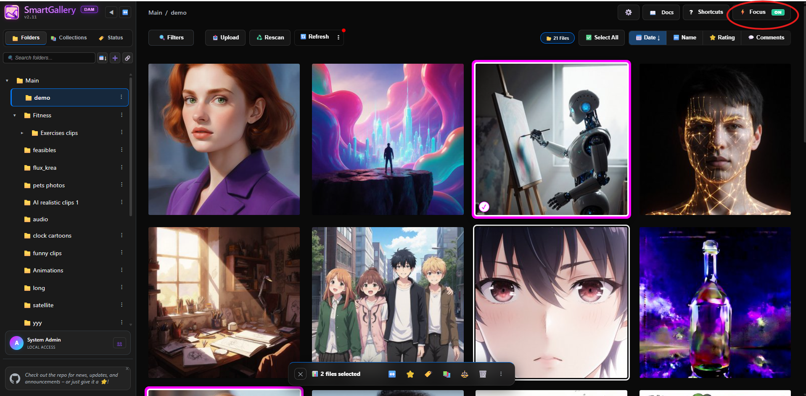

*Focus Mode ON: all clutter removed, fuchsia border on the selected file, batch bar still accessible.*

> **Power User Tip:** Enable Auto-Watch, activate Focus Mode with `Q`, then use `←→` arrows + `Del`/`F`/`X` to blaze through a batch while it's still generating.

---

### 3.1.5 Batch Selection Bar

Click the checkmark `✓` on any image (or `Space`/`X` in Focus Mode) to select it. The floating **Selection Bar** appears at the bottom.

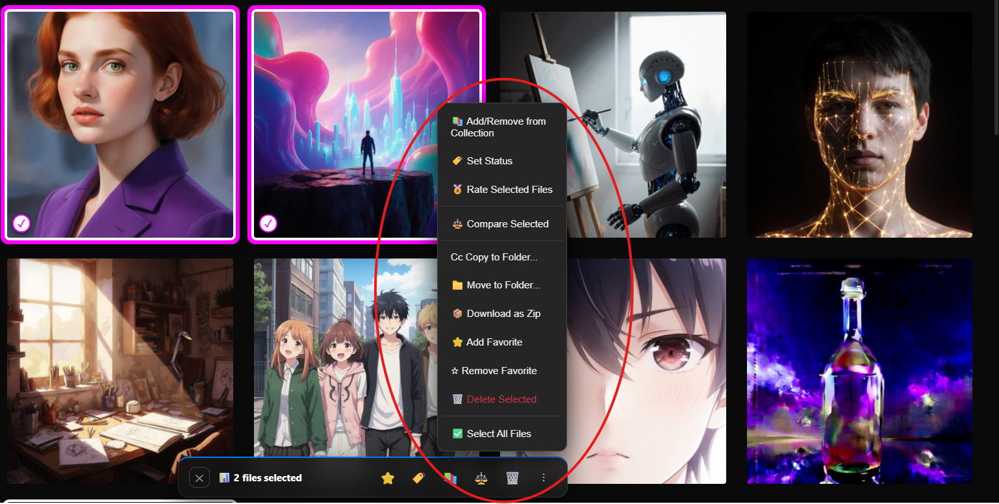

*Batch selection bar: 2 files selected (fuchsia borders), context menu open with all available batch actions.*

| Action | Shortcut | Description |
|---|---|---|
| ✕ Deselect All | `Esc` | Clears the selection |
| ✅ Select All | `Ctrl+A` | Selects all visible files |
| ↔️ Range Select | — | Appears when exactly 2 files selected; selects all between them |
| ⭐ Add Favorite | — | Marks all selected as favorites |
| 🏷 Set Status | `Y` | Apply a pipeline color tag to the batch |
| 📚 Add/Remove Collections | `A` | Add or remove batch from virtual albums |
| ⚖️ Compare Selected | — | Split-screen comparison (exactly 2 files required) |
| 🏅 Rate Selected | `Shift+R` | Apply 1–5 stars to multiple files at once |
| 📁 Move / Copy | `M` | Transfer files to another physical folder |
| 📦 Download as Zip | `Z` | Package selection into a downloadable `.zip` |
| ☆ Remove Favorite | — | Remove the favorite flag from the batch |
| 🗑️ Delete Selected | `Del` | Permanently delete selected files |

---

## 3.2 Advanced Media Inspection

### 3.2.1 The Lightbox (Media Viewer)

Open the full-screen Lightbox with `V` or `Enter`. When Focus Mode is OFF, clicking an image also works.

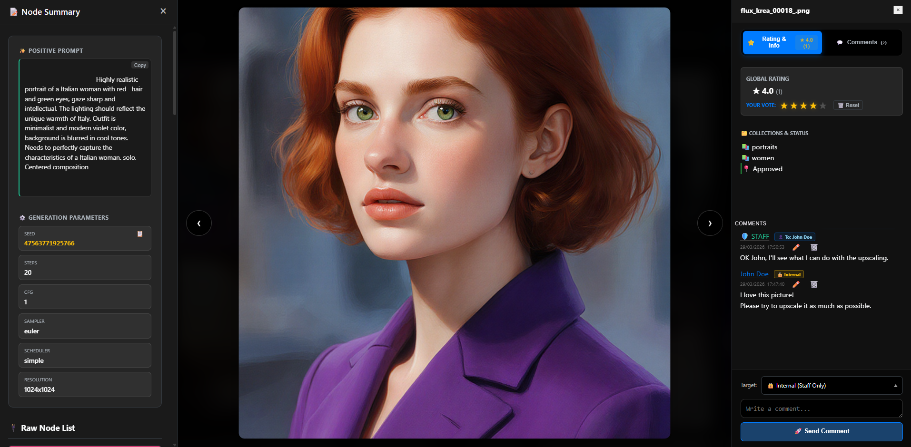

*The Lightbox: Node Summary panel (left), full-resolution image (center), Ratings & Comments panel (right). All three panels can be shown or hidden independently.*

 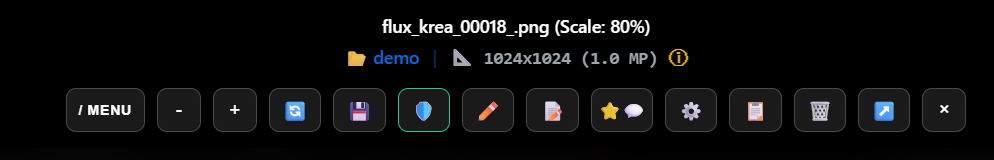

*The Lightbox toolbar: / MENU · − · + · Rotate · Download · Clean Export · Rename · Node Summary · Ratings&Comments · Workflow · Copy JSON · Delete · Open in New Tab · × Exit*

**Toolbar Buttons:**

| Button | Key | Description |
|---|---|---|
| / MENU | `/` | Touch-friendly list of all commands |
| − / + | `-` / `+` | Zoom out / Zoom in |
| 🔄 Rotate | `T` | Rotate 90° (non-destructive) |
| 💾 Download | `S` | Download original file |
| 🛡 Clean Export | `Shift+W` | Download with all metadata stripped (prompts, nodes, EXIF) |
| ✏️ Rename | `R` | Rename file on disk |
| 📝 Node Summary | `N` | Open ComfyUI generation dashboard |
| ⭐💬 Ratings & Comments | `G` | Open side panel for ratings and messages |
| ⚙️ Workflow JSON | `W` | Download raw ComfyUI `.json` workflow |
| 📋 Copy JSON | `C` | Copy workflow to clipboard |
| 🎞 Storyboard | `E` | Generate 11-frame video overview |
| 📁 Move File | `M` | Open the Move File dialog |
| 👁 Hide Toolbar | `H` | "Clean View" — hides all chrome |
| ↗️ Open in New Tab | `O` | Full-resolution in a new browser tab |
| 🗑️ Delete | `Del` | Delete the file |
| × Exit | `Esc` | Return to Grid View |

---

### 3.2.2 ComfyUI Node Summary (📝)

Press `N` on any image (in the grid or in the Lightbox) to open the Node Summary.

<table width="100%">
  <tr>
    <td align="center" width="50%" valign="top">
      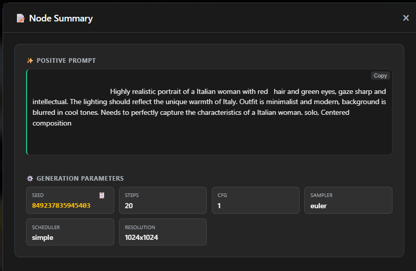<br>
      <em>Node Summary dashboard: positive prompt with one-click Copy, and all generation parameters at a glance.</em>
    </td>
    <td align="center" width="50%" valign="top">
      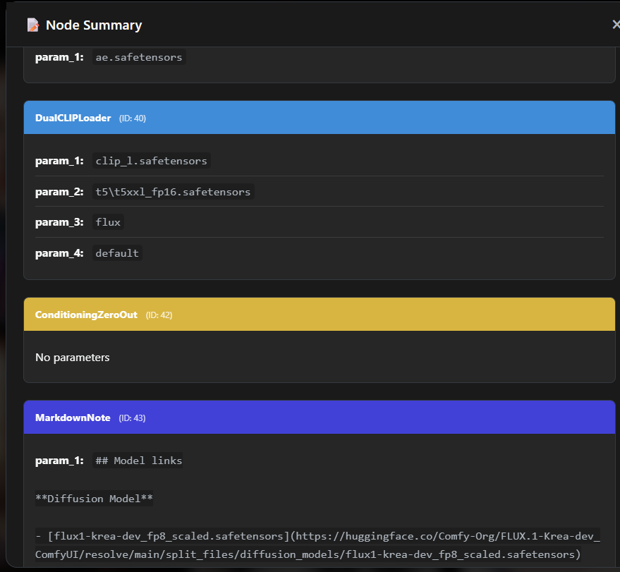<br>
      <em>Raw Node List: every single node in the ComfyUI graph (DualCLIPLoader, ConditioningZeroOut, MarkdownNote…) with all parameters.</em>
    </td>
  </tr>
</table>

**The dashboard shows:**
- **Positive & Negative Prompts** — with one-click Copy buttons
- **Generation Parameters** — Seed (with copy button), Steps, CFG, Sampler, Scheduler, Resolution
- **Active LoRAs** — all LoRAs used and their weights
- **Source Media (Inputs)** — if the workflow used Image2Image, ControlNet, or Video inputs, the source media is displayed and downloadable directly from this panel
- **Raw Node List** — complete scrollable list of every node in the workflow graph

---

### 3.2.3 Compare Mode (⚖️)

Select exactly **2 files**, click `⋮` in the Selection Bar → **Compare Selected**.

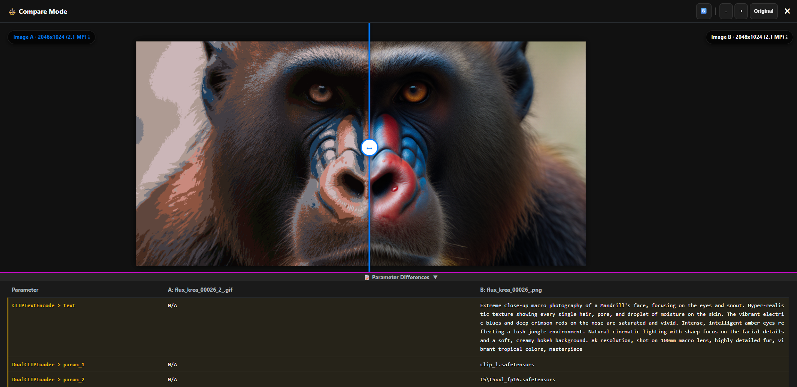

*Compare Mode: drag the central handle to compare the two images. The Parameter Differences table below shows only the values that changed between the two generations.*

-   **Visual Slider:** Drag the central handle to compare. Videos synchronize automatically.
-   **Parameter Differences (`I`):** Table showing only the parameters that changed (e.g., CFG: 4.0 → 8.0, different prompt, different LoRA weights).

---

### 3.2.4 Video Storyboard (🎞)

Press `E` in the Lightbox on any video file.

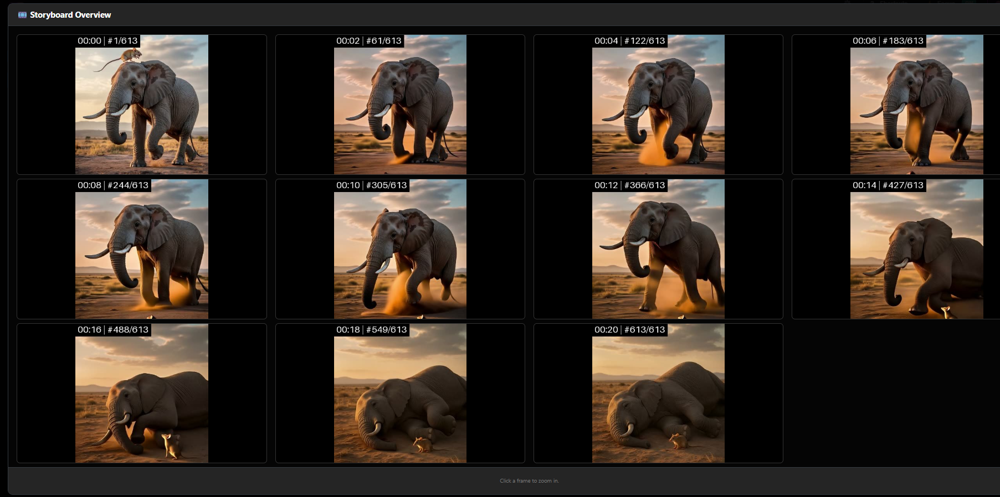

*Video Storyboard: 11 perfectly spaced frames extracted from the video. Click any frame to zoom in with timestamp data.*

SmartGallery uses FFmpeg to extract **11 perfectly spaced frames** and display them in a grid, letting you evaluate the entire motion arc and consistency at a glance — without scrubbing.

---

## 3.3 Digital Asset Management (DAM) & Communication

### 3.3.1 Virtual Collections

Collections are **virtual albums** — group files from different physical folders without moving them on disk.

 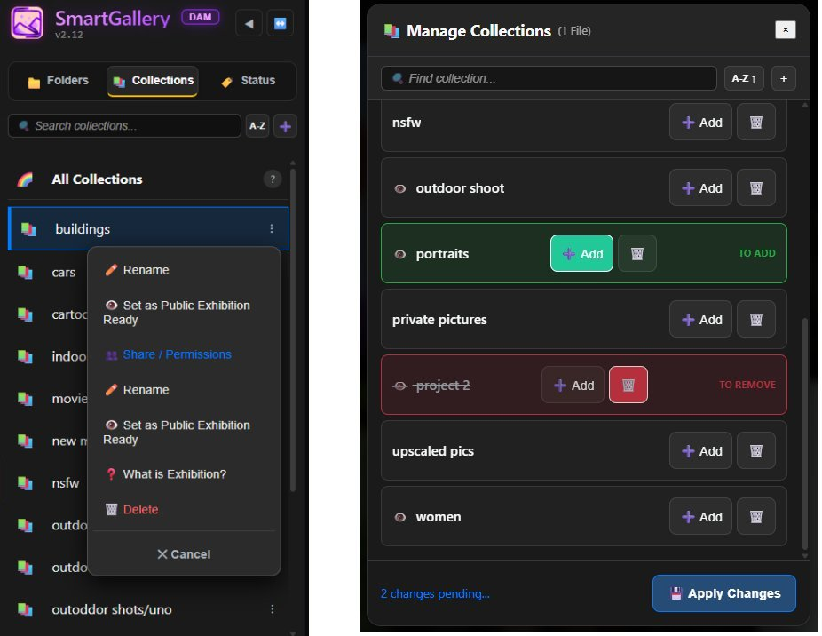

*Left: Collections sidebar tab with the context menu (Rename, Set as Exhibition Ready, Delete). Right: Manage Collections modal — add or remove the selected file from any collection, with pending changes shown.*

-   **Create:** Collections tab in the sidebar → `+` → name it → choose Public or Private.
-   **Add files:** Select files → click 📚 in the Selection Bar or press `A`.
-   **Untag (`U`):** Remove files from the current collection without deleting them from disk.

#### Exhibition Ready vs. Private

Click `⋮` next to any collection to toggle **Exhibition Ready** status:

-   **Private (default):** Strictly internal. Invisible to clients and guests.
-   **Exhibition Ready 👁:** Pushed to the Exhibition Portal, visible to clients and guests. Toggleable at any time.

---

### 3.3.2 Pipeline Status Tags

 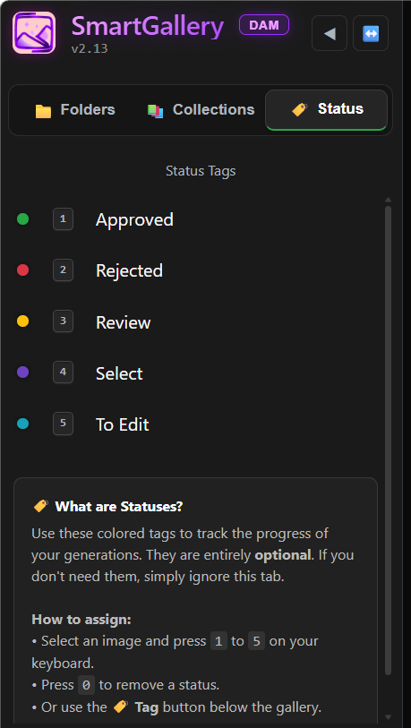

*The Status tab: all five pipeline states with their color coding and the keyboard shortcut for each.*

The **Status tab** in the sidebar lets you browse all files at a given pipeline stage, across every folder at once.

**How to assign:** hover over an image (or select a batch) and press:

| Key | Status | Color |
|---|---|---|
| `1` | Approved | Green |
| `2` | Review | Yellow |
| `3` | To Edit | Blue |
| `4` | Rejected | Red |
| `5` | Select | Purple |
| `0` | Remove status | — |

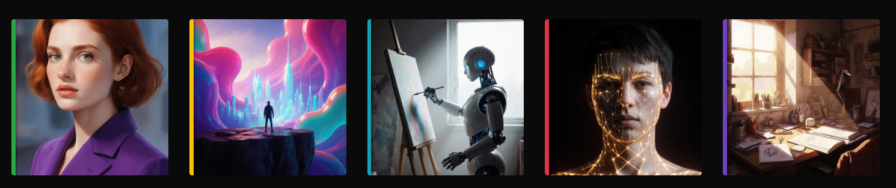

*A vertical color bar on the left edge of each thumbnail indicates the file's pipeline status. No bar = no status assigned.*

You can also use `Y` to open the tagging modal on a batch selection. Status tags are entirely optional.

---

### 3.3.3 Ratings & Comments (⭐💬)

Both interfaces share a **unified communication database**. Press `G` on any image to open the Ratings & Comments panel.

 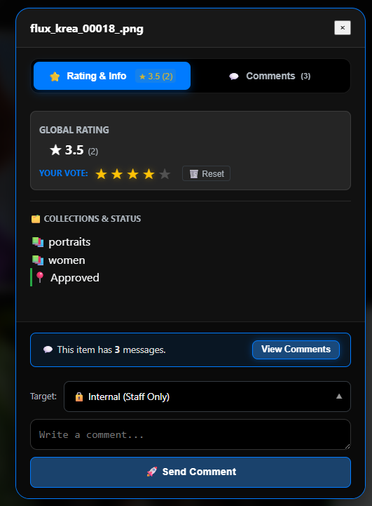

*The Ratings & Comments panel: Global Rating (average of all users), your personal vote with Reset button, file's collections and pipeline status, and comment thread.*

#### Ratings

-   Click ⭐ stars (1–5) to cast a personal vote. Click 🗑 **Reset** to remove it.
-   **Global Rating** = average of all users (staff + clients in Exhibition).
-   **Batch rating:** select multiple files → press `Shift+R`.

#### Comments & Visibility

 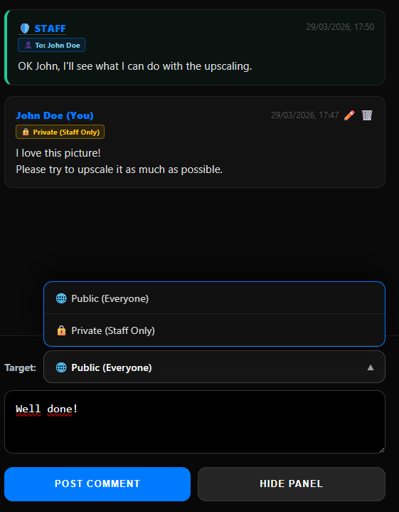

*Comments thread: a STAFF Direct Message (To: John Doe) and a Private (Staff Only) message from the client. The visibility dropdown is open showing all options.*

When writing a comment, choose who can read it from the dropdown:

| Visibility | Who sees it |
|---|---|
| 🌐 **Public (Everyone)** | All users in both Main Workspace and Exhibition |
| 🔒 **Internal / Private (Staff Only)** | Only Admin, Manager, Staff — clients never see these |
| 👤 **Direct Message (To: User)** | Only that specific user and Staff — click a username to pre-select |

Every message displays a colored badge showing its visibility at a glance. Comment text is **fully searchable** from the Filters panel.

---

## 3.4 User Management & Access Control

If you work alone, skip this section — the system works without it.

 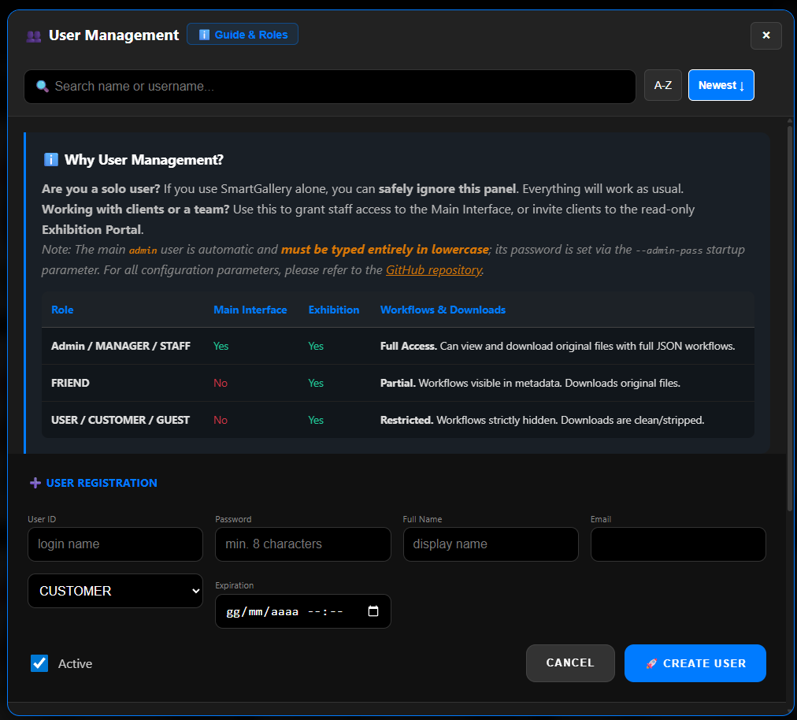

*User Management panel: role permissions table (Admin/Manager/Staff, Friend, User/Customer/Guest), and the user registration form below.*

Click the 👥 icon at the bottom of the sidebar to open the User Management panel.

### Role Permissions

| Role | Main Interface | Exhibition | Workflows | Downloads |
|---|---|---|---|---|
| **admin / MANAGER / STAFF** | ✅ Yes | ✅ Yes | Full access | Original + JSON workflows |
| **FRIEND** | ❌ No | ✅ Yes | Visible in metadata | Original files (with embedded metadata) |
| **USER / CUSTOMER / GUEST** | ❌ No | ✅ Yes | Hidden | Clean/stripped only |

-   **admin:** The built-in root user. Case-sensitive — always **lowercase**. Password set via `--admin-pass`.
-   **MANAGER / STAFF:** Full access to Main Interface. Can read and respond to all comments.
-   **FRIEND:** Exhibition only. Downloads original files (metadata intact, but Node Summary panel not available).
-   **USER / CUSTOMER / GUEST:** Exhibition only. All downloads are metadata-stripped — no workflow can be recovered even with external tools.
-   **Guest (anonymous):** With `--enable-guest-login`, anonymous users browse Exhibition without an account; they choose a nickname before posting their first comment.

### Creating a User Account

Fill in: **User ID** (login name) · **Password** (min. 8 chars) · **Full Name** (display name) · **Email** (optional) · **Role** · **Expiration** (optional) · **Active** toggle.

---

## 3.5 The Exhibition Portal (Client Hub)

**Access:** Launch with `--exhibition`, typically on port 8190.

### 3.5.1 Exhibition Interface Overview

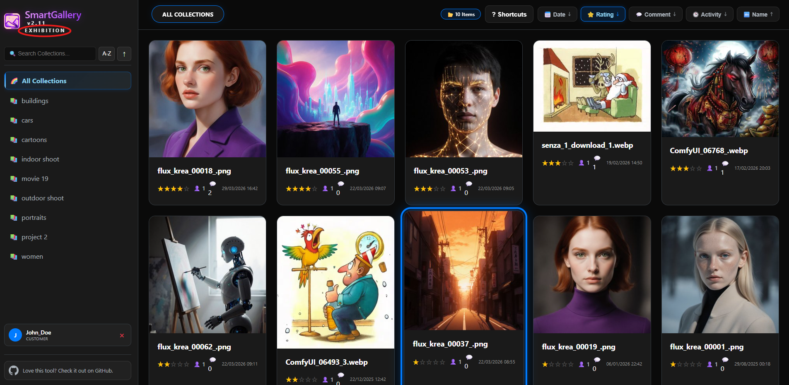

*The Exhibition Portal: clean, curated grid showing only Exhibition Ready collections. Each card shows the global average rating and comment count. No prompts, no folders, no workflow data visible.*

The Exhibition portal is designed for non-technical users — clients, art directors, friends.

-   **Strictly Read-Only:** Guests can vote and comment; they cannot delete, move, rename, or alter files.
-   **Metadata Stripped:** Workflows, prompts, and EXIF are completely hidden. Downloads are always clean.
-   **Curated View:** Guests see only collections marked Exhibition Ready by the Admin.

**Grid & Navigation:**
-   **Sidebar:** Switch between collections, search by collection name.
-   **Sorting:** Newest · Top Rated · Latest Commented · Most Commented · A-Z.
-   **Media Cards:** Each thumbnail shows the global average rating (★) and comment count (💬).

---

### 3.5.2 Theater Mode (Exhibition Lightbox)

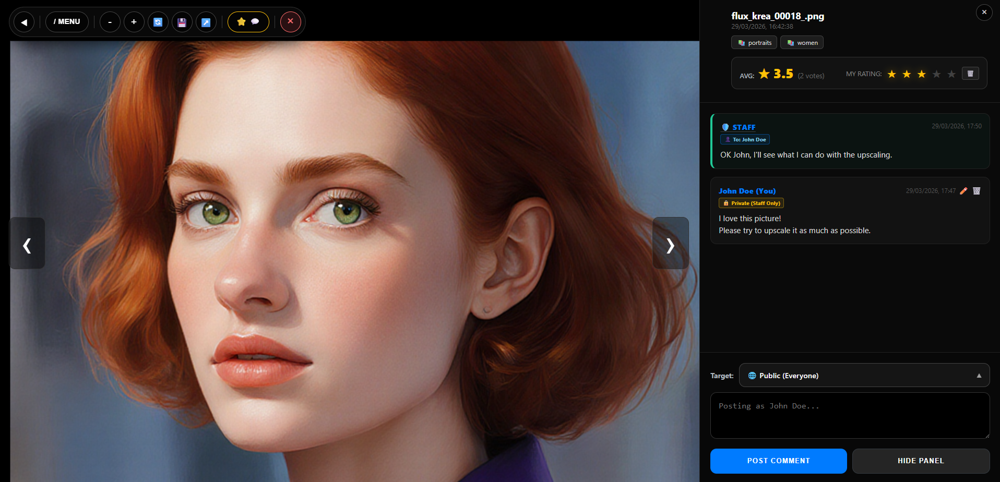

*Theater Mode: full-resolution image with the Ratings & Comments panel open. Shows the global average rating, the user's personal vote, and a comment thread with visibility badges (To: John Doe, Private Staff Only).*

Clicking any image opens it in the **Theater** — the Exhibition's version of the Lightbox.

-   **Media Controls:** Zoom (`+`/`-`), Rotate (`T`), Download (`S`), Open in New Tab (`O`).
-   **Rating & Comment Panel (`G`):**
    -   Rate 1–5 stars by clicking or pressing `1`–`5` on keyboard; `0` to clear.
    -   Read messages addressed to you and public messages.
    -   Post comments as Public (everyone) or Private (staff only).
-   **Mobile:** Comments panel collapsed by default; tap 💬 **Show Comments** to expand.

---

## 4. ADVANCED TOPICS & REFERENCE

### 4.1 Sharing Online

By default SmartGallery runs on your local network. If you want to reach it from outside your home or share Exhibition with clients over the internet, you have two options: a **reverse proxy** (if you have a server or VPS with a domain), or a **tunnel service** (if you just want to share quickly with no server).

In both cases: Exhibition (port 8190) is designed for external access. The Main Interface (port 8189) can also be exposed externally, but always use `--admin-pass` and `--force-login` when you do.

<details>
<summary><strong>Reverse Proxy with Nginx</strong></summary>

Use this if you have a server, VPS, or NAS running Nginx and want SmartGallery accessible at a clean URL or on port 80/443. Configure one block per instance.

```nginx
# Main Interface (port 8189)
location /studio/ {
    proxy_pass http://127.0.0.1:8189/galleryout/;
    proxy_set_header Host $host;
    proxy_set_header X-Real-IP $remote_addr;
    proxy_set_header X-Forwarded-For $proxy_add_x_forwarded_for;
}

# Exhibition (port 8190)
location /gallery/ {
    proxy_pass http://127.0.0.1:8190/galleryout/;
    proxy_set_header Host $host;
    proxy_set_header X-Real-IP $remote_addr;
    proxy_set_header X-Forwarded-For $proxy_add_x_forwarded_for;
}
```

You can also dedicate a full subdomain to each instance (e.g. `studio.yourdomain.com` and `gallery.yourdomain.com`) using separate `server {}` blocks.

</details>

<details>
<summary><strong>Reverse Proxy with Apache</strong></summary>

Requires `mod_proxy` and `mod_proxy_http` enabled (`a2enmod proxy proxy_http`).

```apache
# Main Interface (port 8189)
<Location "/studio/">
    ProxyPreserveHost On
    ProxyPass http://127.0.0.1:8189/galleryout/
    ProxyPassReverse http://127.0.0.1:8189/galleryout/
</Location>

# Exhibition (port 8190)
<Location "/gallery/">
    ProxyPreserveHost On
    ProxyPass http://127.0.0.1:8190/galleryout/
    ProxyPassReverse http://127.0.0.1:8190/galleryout/
</Location>
```

</details>

<details>
<summary><strong>No server? Share Exhibition with a tunnel (ngrok, Cloudflare Tunnel, and others)</strong></summary>

If you do not have a server or a domain name but want to share Exhibition with a client or friend outside your local network, tunnel services are the fastest solution. They create a public URL that forwards directly to your local machine, with no router configuration, no static IP, and no hosting fees.

**ngrok** (free tier works for personal use, runs on Windows, macOS, Linux)

Install:

```bash
# macOS
brew install ngrok

# Linux (Debian/Ubuntu)
curl -sSL https://ngrok-agent.s3.amazonaws.com/ngrok.asc | sudo tee /etc/apt/trusted.gpg.d/ngrok.asc
echo "deb https://ngrok-agent.s3.amazonaws.com buster main" | sudo tee /etc/apt/sources.list.d/ngrok.list
sudo apt update && sudo apt install ngrok

# Windows: download the .exe from ngrok.com/download
```

Start your Exhibition instance first, then open the tunnel:

```bash
ngrok http 8190
```

ngrok prints a public URL like `https://a1b2c3d4.ngrok.io`. Share that with your client. It stays active as long as ngrok is running. On the free tier the URL changes every time you restart.

**Alternatives:**

-   **Cloudflare Tunnel** (free, no bandwidth limit, stable permanent URL): best for recurring or long-term sharing. Requires a free Cloudflare account. See [developers.cloudflare.com/cloudflare-one/connections/connect-networks](https://developers.cloudflare.com/cloudflare-one/connections/connect-networks/).
-   **Tailscale**: creates a private mesh network between your devices. Better suited for trusted collaborators or family than for anonymous client access.
-   **Localtunnel**: no account needed, instant setup. Run `npx localtunnel --port 8190`. Less stable for long sessions.

You can tunnel just Exhibition, just the Main Interface, or both. Exhibition is built for external access. The Main Interface is also safe to expose remotely (useful for culling from your phone or working with a distributed team), as long as `--admin-pass` and `--force-login` are active.

Docker users: the same approach works identically. Run your Exhibition container with `-p 8190:8189`, then point ngrok or Cloudflare Tunnel at port 8190 on your host.

</details>

---

### 4.2 Keyboard Shortcuts Reference

<details>
<summary><strong>Main Interface shortcuts</strong></summary>

**Global App Controls**

| Shortcut | Action |
|---|---|
| `?` | Open Shortcuts Help panel |
| `Q` | Toggle Focus Mode (hides UI, enables keyboard-only grid navigation) |
| `T` | Scroll to Top and open Search/Filters |
| `P` | Toggle Video Autoplay on/off |
| `L` | Refresh view (sync with disk) |
| `K` | Open Rescan Folder modal |
| `Ctrl+A` / `Cmd+A` | Select all files in current view |
| `Esc` | Close any modal, overlay or menu / deselect all |
| `Home` / `End` | Scroll instantly to top / bottom |
| `PgUp` / `PgDn` | Scroll page by page |

**Grid: Single Item Actions**
*(hover over an item, or navigate with arrow keys in Focus Mode)*

| Shortcut | Action |
|---|---|
| `V` / `Enter` | Open Lightbox (full screen view) |
| `X` / `Space` | Select / deselect item |
| `N` | View Node Summary (ComfyUI generation data) |
| `F` | Toggle Favorite |
| `A` | Add to / remove from Virtual Collection |
| `W` | Download Workflow JSON |
| `Shift+W` | Clean Export: download stripped of all metadata |
| `C` | Copy Workflow JSON to clipboard |
| `S` | Download original media file |
| `R` | Rename file |
| `E` | Generate Video Storyboard (videos only) |
| `G` | Open Details Panel: rate, post or read comments, view collections |
| `Shift+R` | Batch Rate: Opens the batch rating modal for selected files in the grid |
| `Del` | Quick delete |

**Grid: Selection and Batch Actions**

| Shortcut | Action |
|---|---|
| `Click` | Focus Mode OFF: opens Lightbox. Focus Mode ON: selects item. |
| `Ctrl+Click` | Add single item to selection |
| `Shift+Click` | Select a range between two files |
| `A` | Add / remove selection to / from a Collection |
| `Y` | Open Status Tagging modal |
| `M` | Move selected files to another folder |
| `U` | Remove selection from current Virtual Collection |
| `Z` | Download selection as ZIP |
| `Shift+R` | Batch Rate: Opens the batch rating modal for selected files in the grid |
| `Del` | Delete entire selection |
| `Esc` | Deselect all |

**Status Tags**
*(works on a single hovered item or a batch selection)*

| Shortcut | Action |
|---|---|
| `1` | Approved (Green) |
| `2` | Review (Yellow) |
| `3` | To Edit (Blue) |
| `4` | Rejected (Red) |
| `5` | Select (Purple) |
| `0` | Clear status |

**Lightbox**

| Shortcut | Action |
|---|---|
| `←` / `→` | Navigate previous / next media |
| `+` / `-` | Zoom in / out |
| `0` | Reset zoom and pan |
| `T` | Rotate media 90° |
| `H` | Hide / show UI (clean view) |
| `/` | Open interactive Quick Menu |
| `N` | View Node Summary |
| `F` | Toggle Favorite |
| `A` | Add to / remove from Collection |
| `Y` | Set Status Tag |
| `G` | Open Ratings and Comments panel |
| `W` | Download Workflow JSON |
| `Shift+W` | Clean Export (no metadata) |
| `C` | Copy Workflow JSON |
| `R` | Rename file |
| `E` | Generate Video Storyboard |
| `M` | Move file |
| `S` | Download media |
| `O` | Open full-res in new tab |
| `Del` | Delete file |
| `Esc` / `V` | Close Lightbox |

**Compare Mode and Storyboard**

| Context | Shortcut | Action |
|---|---|---|
| Compare Mode | `+` / `-` | Synchronized zoom in / out |
| Compare Mode | `0` | Reset zoom |
| Compare Mode | `I` | Toggle Parameter Differences panel |
| Storyboard | `←` / `→` | Navigate frames (when a frame is zoomed) |
| Both | `Esc` | Close current mode |

</details>

<details>
<summary><strong>Exhibition Portal shortcuts</strong></summary>

**Grid Navigation**

| Shortcut | Action |
|---|---|
| `←` `↑` `→` `↓` | Move keyboard focus across the grid |
| `Enter` / `V` | Open focused item in Theater (Lightbox) |
| `Home` / `End` | Jump to first / last item |
| `PgUp` / `PgDn` | Scroll page rapidly |
| `?` | Open Shortcuts Help panel |

**Quick Rating**
*(works on the focused grid item or the item open in Theater)*

| Shortcut | Action |
|---|---|
| `1` to `5` | Rate media from 1 to 5 stars |
| `0` | Clear your rating |

**Theater (Lightbox)**

| Shortcut | Action |
|---|---|
| `←` / `→` | Navigate previous / next media |
| `/` | Open Quick Action Menu |
| `H` | Toggle toolbar (clean view) |
| `G` | Toggle Ratings and Comments panel |
| `T` | Rotate media 90° |
| `+` / `-` | Zoom in / out |
| `0` | Reset zoom and rotation |
| `S` | Download media |
| `O` | Open full-res in new tab |
| `/` | Quick Menu |
| `Esc` | Close Theater |

</details>

---

### 4.3 Experimental Features

The [`/experiments`](experiments/) folder contains beta versions and hotfixes under active development.

Use at your own risk. Always back up before testing.

---

### 4.4 Philosophy, Feedback & License

**Philosophy**

Local-first. Privacy-first. Minimal dependencies. Cross-platform. Cross-device. No forced upgrades. No vendor lock-in.

---

**Contributing and Feedback**

Issues, ideas, and pull requests are welcome.

-   [Open an issue](../../issues)
-   Fork, branch, PR

---

**License**

MIT License. See [LICENSE](LICENSE)

---

> ### 🎞️ **High-level video overview**
>
> <div align="center">
>   <a href="https://smartgallerydam.com/smartgallery-dam.mp4">
>     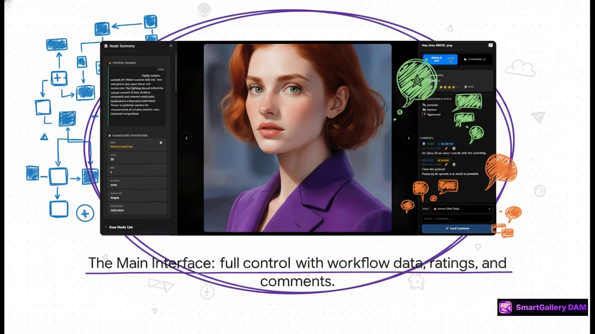
>   </a>
>   <br>
>   <em>If you have 6 minutes, watch this video to understand the concept and strategy behind SmartGallery DAM.</em><br>
>   <em>(Click on the image to play the video)</em>
> </div>

---

<p align="center">
  <a href="https://smartgallerydam.com"><strong>smartgallerydam.com</strong></a> · full documentation, wiki and feature reference
  <br><br>
  <em>Made for the ComfyUI community and every digital creator who takes their work seriously.</em>
</p>

---