# ComfyUI Queue Deck — User Manual

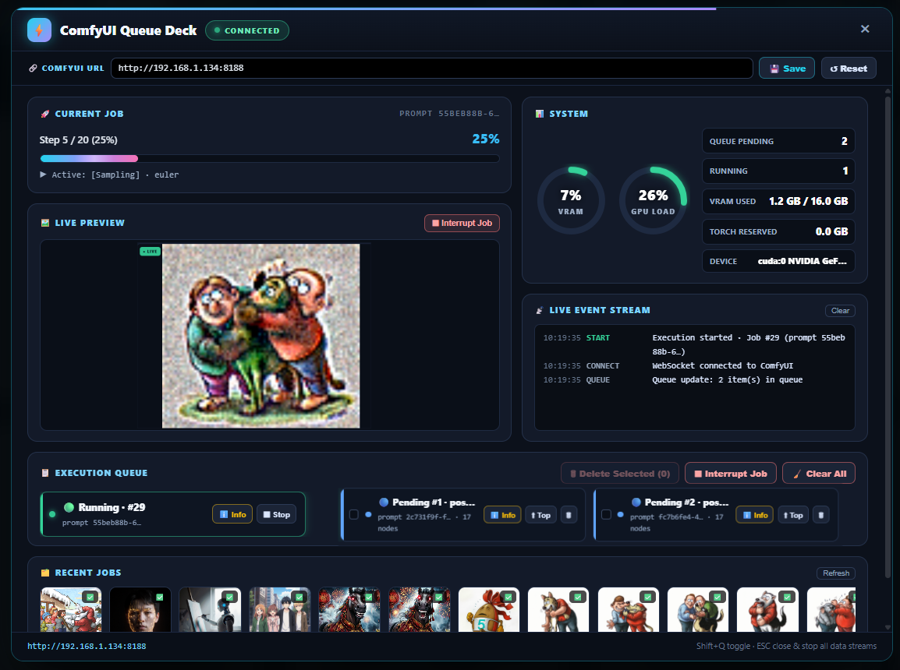
*Figure 1: ComfyUI Queue Deck Unified Control Interface*

---

## 1. Introduction

**ComfyUI Queue Deck** is a real-time mission control dashboard built directly into **SmartGallery DAM**. It allows digital artists, pipeline directors, and production studios to monitor generation progress, manage execution queues, stream live previews, track hardware telemetry, and inspect completed workflows without leaving the DAM workspace.

Whether ComfyUI is running locally on the same workstation or remotely on a dedicated rendering node across your local network, Queue Deck establishes a persistent, high-throughput connection to give you full operational control over your generative pipeline.

---

## 2. Quick Access & Getting Started

### 2.1 Opening the Queue Deck
You can toggle the ComfyUI Queue Deck overlay from anywhere inside SmartGallery DAM using two methods:

* **Keyboard Shortcut:** Press **`Shift + Q`** on your keyboard.
* **Top Navigation Menu:** Click **`Tools`** in the top navigation bar and select **`ComfyUI Queue Deck`**.

> [!TIP]
> Pressing **`Escape`** (ESC) at any time closes the Queue Deck overlay, immediately stopping data streams to save network and client resources.

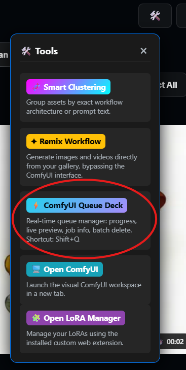
*Figure 2: Accessing Queue Deck via the Tools navigation menu*

---

## 3. Interface Overview

The Queue Deck is organized into four main functional zones:
* CURRENT JOB & SYSTEM TELEMETRY
* LIVE PREVIEW & LIVE EVENT STREAM
* EXECUTION QUEUE
* RECENT JOBS CAROUSEL)
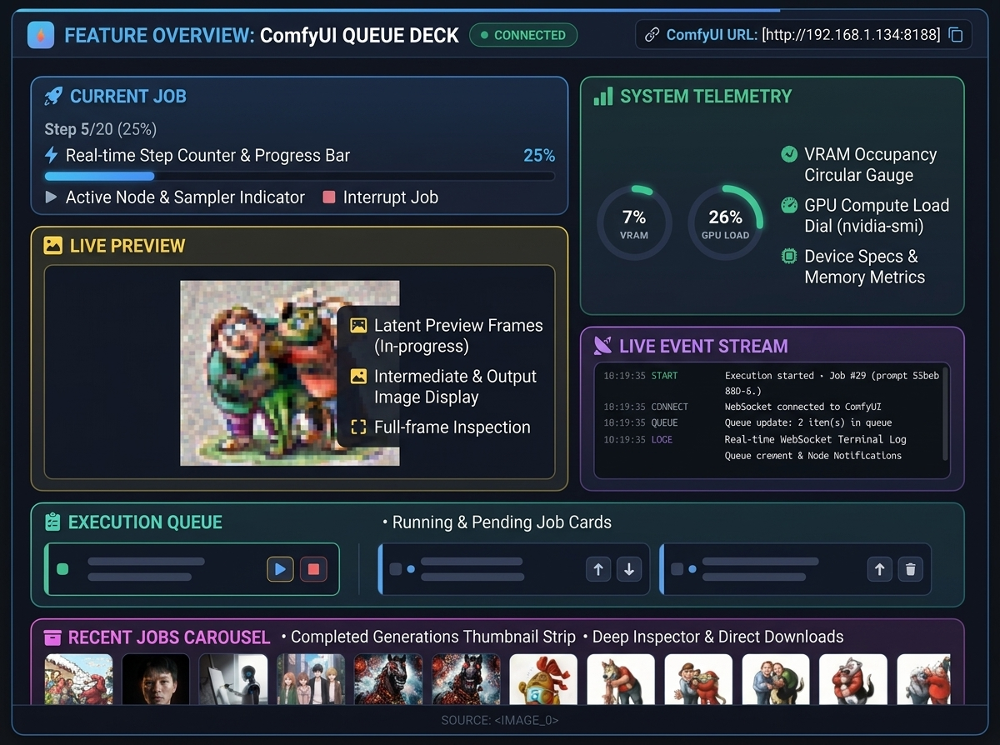

---

## 4. Feature Breakdown & Operation

### 4.1 Server Connection & URL Configuration

Located at the top of the deck, the **ComfyUI URL Bar** manages the communication target:

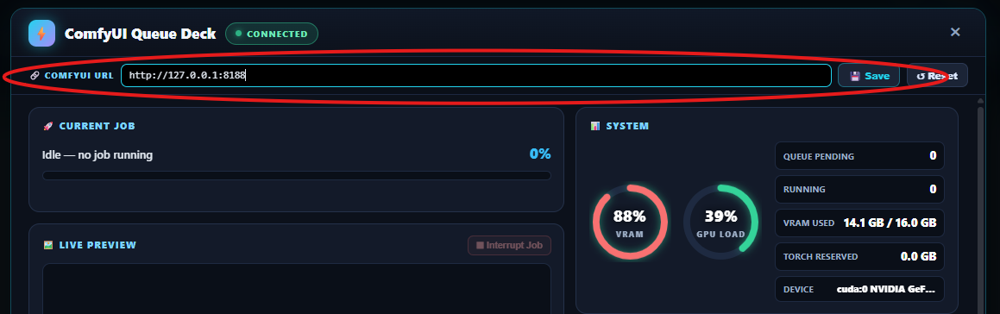
*Figure 3: Server connection bar with status indicator*

* **Status Indicator (`CHECKING`, `CONNECTED`, `OFFLINE`):** Displays real-time WebSocket and HTTP connectivity status.
* **Target Address Input:** Defaults to `http://127.0.0.1:8188`. Enter a custom IP/port if your ComfyUI instance runs on another machine (e.g., `http://192.168.1.150:8188`).
* **💾 Save:** Saves the target address to your browser's persistent storage.
* **↺ Reset:** Restores the default server URL configured in `smartgallery.py` / `COMFYUI_SERVER_URL`.

---

### 4.2 Current Job & Progressive Step Tracker

The **Current Job** module monitors active generations with dual-engine accuracy:

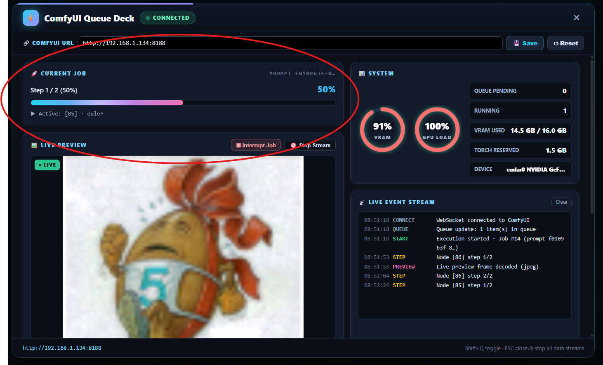
*Figure 4: Active step progression, sampler telemetry, and prompt ID*

* **Live Step Counter (`Step X / Y (Z%)`):** Automatically extracts total steps from workflow sampler nodes (`KSampler`, `SamplerCustom`, `WanVideo`, etc.) and displays the active generation step in real time.
* **Proportional Progress Bar:** Smoothly fills in proportion to the active step progression.
* **Active Node & Sampler Telemetry:** Shows the specific node currently executing on the GPU alongside the active sampler algorithm (e.g., `▶ Active: [KSampler] · euler`).
* **Prompt ID Badge:** Displays a truncated prompt UUID for fast reference and tracking.

---

### 4.3 Live Preview Engine

The **Live Preview** module renders generations as they unfold:

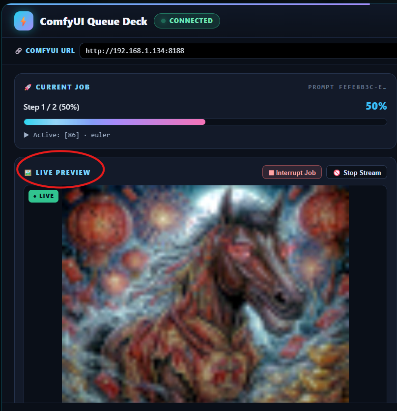
*Figure 5: In-progress generation preview with live streaming controls*

* **Binary Frame Decoding:** Decodes live WebSocket preview frames (supporting JPEG, PNG, WebP, and raw unencoded tensor buffers).
* **Intermediate Output Capture:** Automatically polls and renders output images produced by workflow nodes (`PreviewImage`, `SaveImage`, `VAEDecode`).
* **Status Badges:**
  * **`● LIVE` (Green):** Actively receiving progressive preview frames.
  * **`● READY` (Blue):** The current generation has completed its final image.
* **Control Actions:**
  * **⏹ Interrupt Job:** Immediately halts the running generation.
  * **🚫 Stop Stream / ▶️ Resume Stream:** Pauses/resumes preview rendering to conserve client rendering overhead.
* **Automatic Idle Reset:** When the queue finishes and no jobs are left to process, the preview canvas cleanly resets to the waiting placeholder.

> [!NOTE]
> **Enabling Live Latent Step Previews in ComfyUI:**  
> By default, standard ComfyUI runs with `--preview-method none`. To see live step-by-step latent previews streaming during sampling, launch ComfyUI with:  
> `python main.py --preview-method auto` (or `--preview-method taesd` for ultra-fast previews).

---

### 4.4 System & Hardware Telemetry

The **System** card provides driver-level hardware health metrics:

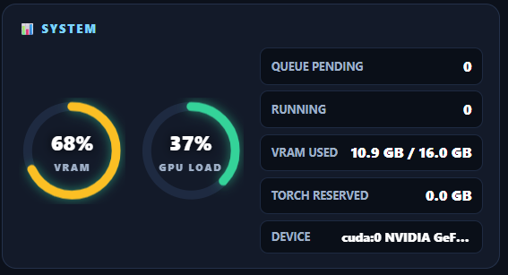
*Figure 6: VRAM occupancy and GPU compute load telemetry*

* **VRAM Occupancy Gauge:** Displays the percentage and exact gigabyte usage (`Used / Total GB`) of driver-level video memory.
* **GPU Load Gauge:** Measures real-time GPU engine compute utilization via native `nvidia-smi` telemetry.
* **Torch Reserved Memory:** Displays memory allocated and reserved by PyTorch tensors.
* **Device Tooltip:** Hover over the **DEVICE** badge to view the full model name and CUDA compute device specification.

---

### 4.5 Live Event Stream

The **Live Event Stream** terminal logs chronological lifecycle updates in real time:

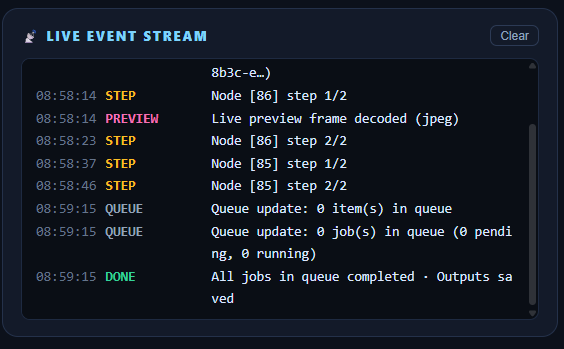
*Figure 7: Real-time event log with categorized event tags*

* **`CONNECT` / `DISCONNECT`:** Network connection lifecycle.
* **`QUEUE`:** Instant notification of queue decrements, pending count changes, and total items.
* **`START`:** Job execution start notifications with Prompt ID and Queue position.
* **`NODE`:** Active node execution switches.
* **`STEP`:** Sampler step milestone updates.
* **`OUTPUT`:** Image/video output readiness notifications.
* **`SUCCESS` / `ERROR` / `STOP`:** Generation completion, traceback exceptions, or manual interrupts.
* **Clear Button:** Wipes the current terminal view.

---

### 4.6 Execution Queue Management

The **Execution Queue** section lists all active and pending generations in execution order:

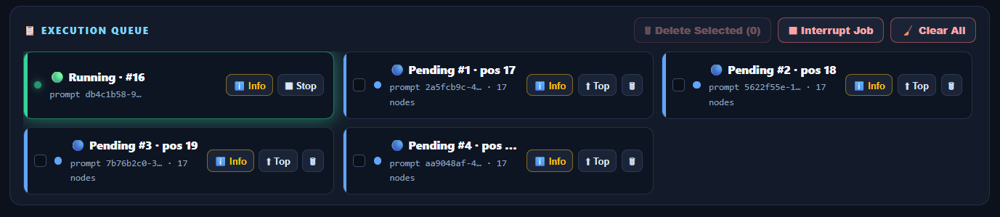
*Figure 8: Interactive running and pending queue management cards*

* **Running Card (🟢 Green Glow):** Highlights the currently generating job with prompt ID and active status.
* **Pending Cards (🔵 Blue):** Displays queued jobs with their execution position and workflow node count.
* **Interactive Actions:**
  * **ℹ️ Info:** Opens the deep **Job Details** dialog for that specific prompt.
  * **⬆ Top (Move to Top):** Re-submits the pending job to the front of the queue.
  * **🗑 (Delete Single):** Removes an individual job from the pending queue.
  * **Checkbox Selection & 🗑 Delete Selected:** Select multiple pending items for batch deletion.
  * **⏹ Interrupt Job:** Stops the currently executing prompt.
  * **🧹 Clear All:** Empties all pending jobs from the ComfyUI queue with a single confirmation.

---

### 4.7 Recent Jobs & Deep Result Inspector

The **Recent Jobs** carousel displays completed generations with instant inspection and download capabilities:

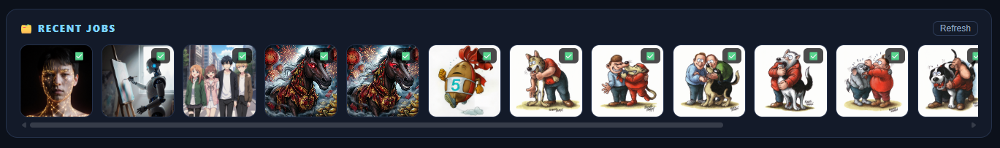
*Figure 9: Completed generations carousel and status badges*

Clicking on any thumbnail in the carousel opens the **Job Result Inspector**:

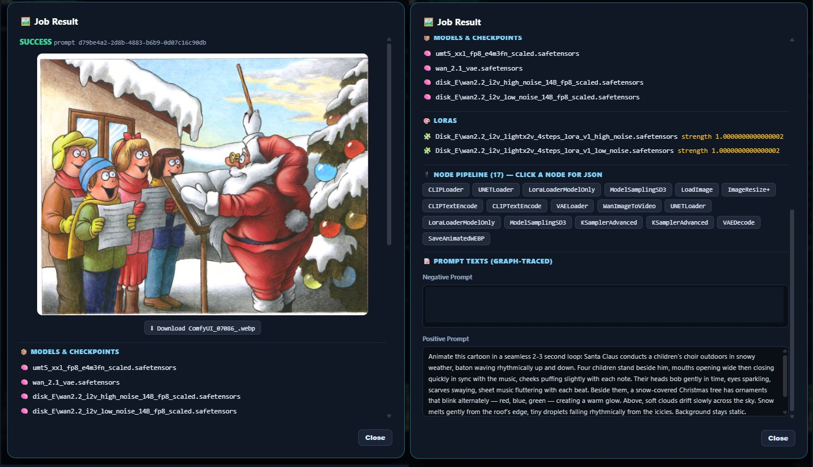
*Figure 10: Deep job result inspector with prompt tracing, model details, and node chips*

* **Direct Media Download (`⬇ Download`):** Downloads the generated image or video directly to your browser's download folder using a native binary blob stream.
* **📦 Models & Checkpoints:** Lists all model checkpoint files used in the generation.
* **🎨 LoRAs & Weights:** Displays applied LoRAs alongside their exact model and CLIP strength multipliers.
* **📝 Graph-Traced Prompts:** Displays extracted Positive and Negative text prompts traced through the node pipeline.
* **🔌 Interactive Node Chips:** Click any node chip in the pipeline to open the raw **Node JSON Viewer** in an isolated modal overlay.

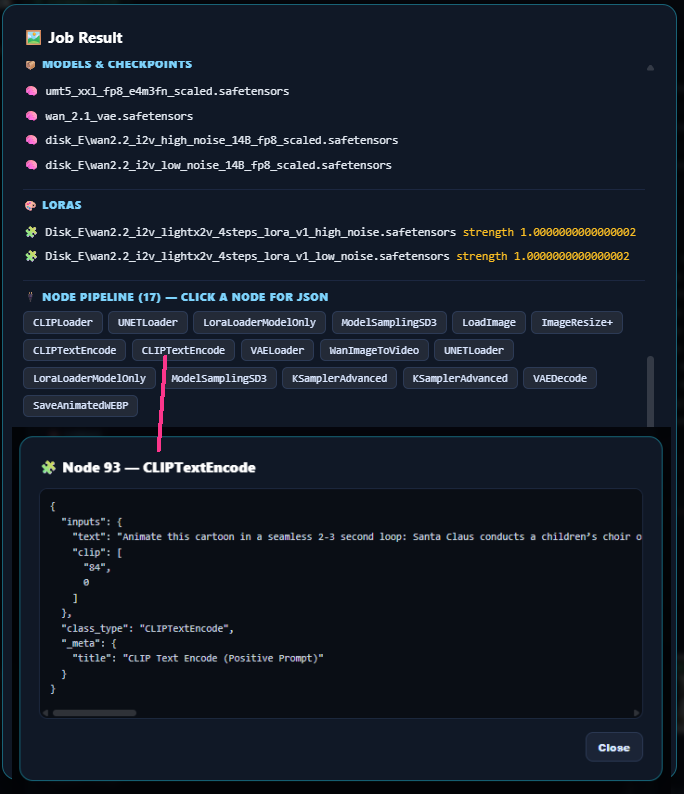
*Figure 11: Interactive Node JSON definition viewer*

---

## 5. Keyboard Shortcuts Reference

| Shortcut | Action | Scope |
| :--- | :--- | :--- |
| **`Shift + Q`** | Open / Close ComfyUI Queue Deck | Global (Gallery View) |
| **`Escape`** | Close current dialog, JSON viewer, or Queue Deck | Queue Deck Overlay |
| **`Enter`** | Save and apply custom ComfyUI URL | URL Input Field |

---

## 6. Troubleshooting & FAQ

### Q1: The progress bar advances, but the Live Preview stays on "Waiting for a preview…"
* **Cause:** ComfyUI was launched with default settings where latent-to-RGB decoding during sampling is turned off (`--preview-method none`).
* **Fix:** Start ComfyUI with `--preview-method auto` or `--preview-method taesd`. As soon as sampling begins, binary preview frames will stream directly into the Live Preview box.

### Q2: Status says `OFFLINE` or connection fails
* **Check URL:** Ensure the address in the **ComfyUI URL** bar matches your running instance (e.g., `http://127.0.0.1:8188`).
* **CORS / Network:** If connecting to a remote server across a local network, ensure port `8188` is open and accessible from your browser machine.
* **Retry:** Click **`↺ Reset`** and then **`🔄 Retry Connection`**.

### Q3: How do I move a job to the front of the queue?
* Click the **`⬆ Top`** button on any pending job card. SmartGallery will cancel the prompt and re-submit it at position #1 with all original generation parameters preserved.

---

## 7. About SmartGallery DAM

**SmartGallery DAM** is an open-source, local-first Digital Asset Management platform tailored specifically for AI digital artists, prompt engineers, and production studios working with ComfyUI.

* **GitHub Repository:** [https://github.com/biagiomaf/smart-comfyui-gallery](https://github.com/biagiomaf/smart-comfyui-gallery)
* **Author:** Biagio Maffettone
* **License:** Free to use and modify with attribution (see repository for license terms).
