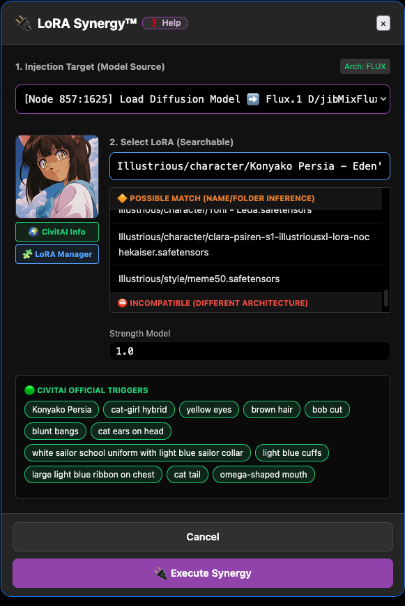

# 🔌 LoRA Synergy™

**Stop guessing which LoRA goes with which checkpoint. Let SmartGallery tell you.**

LoRA Synergy is a zero-API, fully offline LoRA matchmaker and injector built into SmartGallery's **Remix Workflow → Nodepad**. It scans the actual `.safetensors` files on your disk, reads their metadata, and tells you *exactly* which of your installed LoRAs are compatible with the checkpoint currently loaded in your workflow — then wires everything up for you in one click.

No more scrolling through 400 LoRAs guessing if they're SDXL, Flux, or SD1.5. No more black-screen renders because you mixed architectures. No more digging through CivitAI tabs to remember the trigger word.  

---

## Table of Contents

- [Why LoRA Synergy exists](#why-lora-synergy-exists)
- [What it actually does](#what-it-actually-does)
- [Quick Start](#quick-start)
- [Understanding the Match Categories](#understanding-the-match-categories)
- [Chain vs. Replace](#chain-vs-replace)
- [Trigger Words & Memory](#trigger-words--memory)
- [Better together: ComfyUI-Lora-Manager](#better-together-comfyui-lora-manager)
- [Advanced setup (Docker / network drives / custom paths)](#advanced-setup-docker--network-drives--custom-paths)
- [Step-by-step walkthrough](#step-by-step-walkthrough)
- [FAQ & Troubleshooting](#faq--troubleshooting)

---

## Why LoRA Synergy exists

If you've used ComfyUI for more than a week, you know this pain:

- You load someone else's workflow, want to try a different LoRA, and have no idea which of your 200 files will even work with that checkpoint.
- You attach a LoRA, hit queue, and get a cryptic tensor mismatch error five minutes later.
- You *do* find a compatible LoRA, but forgot the trigger word, so your generation looks nothing like the preview.
- Wiring a new `LoraLoader` node into an existing graph means manually rerouting `MODEL` and `CLIP` outputs through every downstream node — tedious and error-prone.

LoRA Synergy solves all four problems in a single panel, without ever calling an external API or requiring an internet connection.

## What it actually does

1. **Reads your graph** and detects every valid injection target — checkpoint loaders, UNET loaders, GGUF loaders, and existing LoRA nodes — directly from the currently open workflow in the Nodepad.
2. **Interrogates your local LoRA files** — not a database, not the cloud, your actual files on disk — to determine their base architecture (SD1.5, SDXL, Flux, and more) by inspecting the safetensors header.
3. **Cross-references** that architecture against the checkpoint you have loaded and instantly buckets every LoRA in your library into ranked compatibility groups.
4. **Surfaces trigger words** automatically, pulling from CivitAI metadata (if available) and from SmartGallery's own history of files you've previously generated.
5. **Auto-wires the graph**: adds the new `LoraLoader` (or `LoraLoaderModelOnly`) node and rewires every downstream `MODEL`/`CLIP` connection that used to point at your checkpoint — so nothing breaks.

All of this happens **locally**. LoRA Synergy never uploads your files or workflow anywhere.

---

## Quick Start

1. Open **Remix Workflow** on any media file (or from the Tools menu / Library).
2. Switch to the **`{ } Nodepad`** tab.
3. Make sure you're in **API Format** (LoRA Synergy currently requires API format — the toolbar will prompt you to switch if needed).
4. Click **🔌 LoRA Synergy™** in the toolbar.
5. Pick your **Injection Target** (your checkpoint, UNET, or an existing LoRA node).
6. Search or browse the ranked LoRA list — 🟢 Perfect Matches are shown first.
7. Click a LoRA, copy a trigger word chip if one appears, adjust strength if needed.
8. Click **🔌 Execute Synergy**.

That's it — the node is created and wired, and you're ready to queue.

---

## Understanding the Match Categories

When you open the injector, your entire local LoRA library is automatically sorted into four groups so you never waste time on incompatible files:

| Category | What it means |
|---|---|
| 🟢 **Perfect Match** | Verified directly from the LoRA's own safetensors header — this is a hard, technical guarantee of architecture compatibility. |
| 🌟 **Proven Match** | You've successfully used this exact LoRA with this checkpoint (or its architecture) before, according to SmartGallery's history. |
| 🔶 **Possible Match** | Inferred from the LoRA's filename or the folder it lives in (e.g. a `Flux/` subfolder) — a good hint, not a guarantee. |
| ⛔ **Incompatible** | Detected as a different base architecture than your checkpoint. Collapsed by default to keep the list clean, but still one click away if you want to override. |

You can always ignore the ranking and search by name — Synergy never blocks you, it just saves you from guessing.

---

## Chain vs. Replace

When your injection target is an existing LoRA node, LoRA Synergy gives you two options:

- **🔗 Add After (Chain)** — creates a brand-new `LoraLoader` node downstream of the one you picked, so you can stack multiple LoRAs.
- **🔄 Replace Existing** — swaps the LoRA in the currently selected node in place, keeping the same node ID and all its existing wiring.

For checkpoint/UNET targets, Synergy always chains a new LoRA node and automatically rewires every node that was previously connected directly to your checkpoint's `MODEL`/`CLIP` outputs — so the graph stays fully connected with zero manual rerouting.

---

## Trigger Words & Memory

Forgetting trigger words is one of the most common reasons a LoRA "doesn't seem to work." LoRA Synergy fixes this two ways:

- **🟢 Official Triggers** — pulled straight from the LoRA's CivitAI metadata when available.
- **💡 Historical Triggers** — pulled from SmartGallery's own database of prompts you've previously paired with this LoRA.

Click any trigger chip to copy it instantly — and it's automatically saved to the floating **🚀 Memory Triggers** panel, a small draggable widget that keeps every trigger you've copied during your session in one place, ready to paste into your prompt node without re-opening the injector.

---

## Better together: ComfyUI-Lora-Manager

LoRA Synergy works out of the box with **zero configuration** on a standard ComfyUI install. But it reaches its full potential when paired with the excellent **[ComfyUI-Lora-Manager](https://github.com/willmiao/ComfyUI-Lora-Manager)** by *willmiao*.

If Lora-Manager is installed, LoRA Synergy automatically detects and uses its metadata to unlock:

- 🖼️ **Preview thumbnails** for every LoRA, right inside the injector panel.
- 🌍 **Direct CivitAI links** for the model you're about to inject.
- 🧩 **One-click deep link** into the Lora Manager UI itself for further browsing.
- More complete **trigger word** extraction, since Lora-Manager keeps CivitAI metadata cached and up to date locally.

**You don't have to install it** — Synergy will still find your models by scanning your standard ComfyUI `models/` folder and will still classify architecture compatibility from the safetensors header alone. But if you want the richest, most visual experience, Lora-Manager is the recommended companion.

👉 [github.com/willmiao/ComfyUI-Lora-Manager](https://github.com/willmiao/ComfyUI-Lora-Manager)

---

## Advanced setup (Docker / network drives / custom paths)

By default, SmartGallery finds your models by scanning your ComfyUI `models/` folder. If you run ComfyUI in an isolated Docker container, on a network drive, or use `extra_model_paths.yaml`, SmartGallery may not be able to see your files automatically.

In that case, set these environment variables before starting the SmartGallery server:

| Variable | Purpose |
|---|---|
| `BASE_MODELS_PATH` | Use if you moved your entire `models/` folder elsewhere. |
| `LORAS_PATH` | Granular override just for your LoRAs folder. |
| `CHECKPOINTS_PATH` | Granular override just for your checkpoints folder. |
| `UNET_PATH` | Granular override for FLUX/SD3-style UNET files. |

Once set, restart the server — LoRA Synergy will pick up the correct paths automatically.

---

## Step-by-step walkthrough

1. **Open a workflow.** In the gallery, press `B` on any media file that contains a ComfyUI workflow (or open one from your saved **Workflow Library**).
2. **Go to the Nodepad.** Click the `{ } Nodepad` tab at the top of the Remix window.
3. **Confirm API Format.** LoRA Synergy only works in API Format — switch the format dropdown in the toolbar if you're in UI Format.
4. **Launch Synergy.** Click **🔌 LoRA Synergy™**. SmartGallery scans your graph for valid targets (checkpoints, UNETs, existing LoRA nodes).
5. **Choose your target.** Pick the node you want to attach a LoRA to from the dropdown. If it's already a LoRA node, choose **Chain** or **Replace**.
6. **Browse ranked results.** Perfect Matches surface first. Use the search box to filter by name or folder if you know what you're looking for.
7. **Preview & inspect.** If Lora-Manager is installed, hover for a thumbnail and click the CivitAI link to double check.
8. **Grab the trigger word.** Click any green or orange trigger chip to copy it — it'll also land in your floating Memory Triggers widget.
9. **Set strengths.** Adjust `Strength Model` and `Strength CLIP` (CLIP strength is hidden automatically for model-only targets like UNETLoader).
10. **Execute.** Click **🔌 Execute Synergy**. The node is created (or replaced) and every downstream connection is automatically rewired.
11. **Add the trigger to your prompt.** Paste the trigger word you copied into your positive prompt node — Synergy reminds you to do this after every injection.
12. **Queue as usual.** Head back to Auto-Form or My Panel, or queue directly from the Nodepad.

---

## FAQ & Troubleshooting

**Why is LoRA Synergy grayed out / asking me to switch format?**
It currently only operates on API Format workflows, since it needs to programmatically read and rewrite node connections. Switch the format dropdown in the Nodepad toolbar to *API Format*.

**Why does it say "Cannot reach ComfyUI"?**
Synergy needs ComfyUI's live node dictionary to know each node's input schema. Make sure ComfyUI is running and that the **ComfyUI Server URL** field at the top of the Remix window points to the right address.

**No targets were found in my graph — why?**
Synergy looks for checkpoint loaders, UNET/diffusion/GGUF loaders, and existing LoRA loader nodes. If your workflow uses a completely custom loader node type without a recognizable model filename, it won't be detected as a target.

**A LoRA I know is compatible shows up under "Incompatible" — what do I do?**
Architecture detection is based on the safetensors header and is highly reliable, but not infallible for unusual or mislabeled files. The Incompatible group is collapsed, not hidden — expand it and select it anyway if you're confident.

**Does this send my files or workflow anywhere?**
No. Every scan, match, and injection happens locally against files already on your machine.

---

*Questions or feedback? Open an issue on the SmartGallery repo — LoRA Synergy is actively evolving.*
